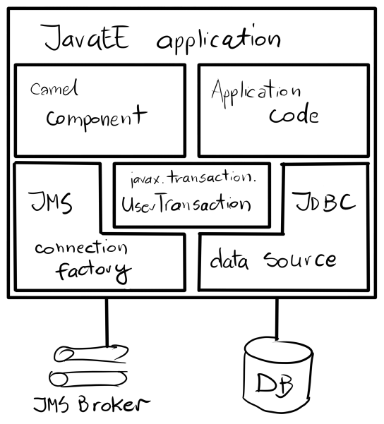
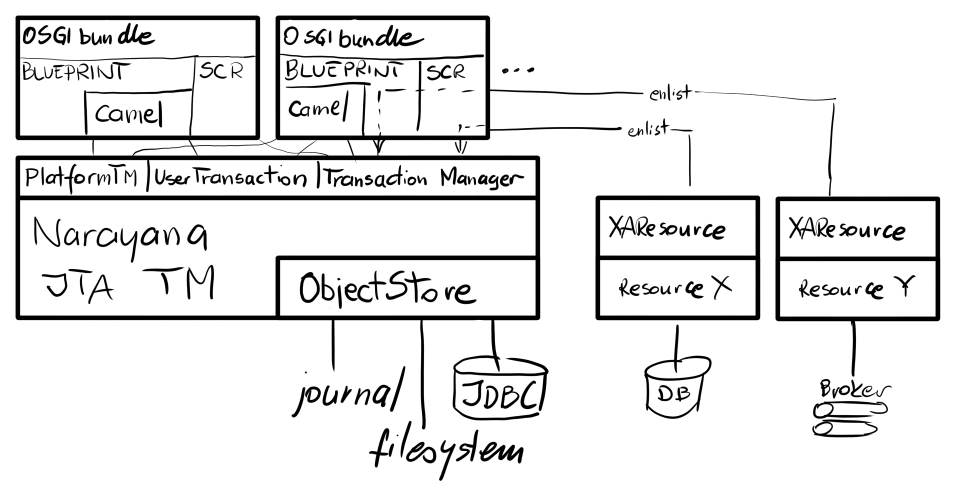

= Choosing the Transaction Manager

.Abstract
This chapter describes how to configure Transaction Manager in {f7} and how to use it in deployed applications.
There's a clear distinction between _configuration_, which is an administrator's activity and _referencing_, which is
just pointing the application to previously configured transaction manager and is the responsibility of developer.

== What is a Transaction Manager?

A transaction manager is the part of an application that is responsible for coordinating transactions across one
or more resources.

The responsibilities of the transaction manager are as follows:

* Demarcation – starting and ending transactions using begin, commit, and rollback methods.
* Managing the transaction context – a transaction context contains the information that a transaction manager needs to
keep track of a transaction. The transaction manager is responsible for creating transaction contexts and attaching
them to the current thread.
* Coordinating the transaction across multiple resources – enterprise-level transaction managers typically have the
capability to coordinate a transaction across multiple resources. This feature requires the 2-phase commit protocol
and resources must be registered and managed using the XA protocol (see the section called <<X/Open XA standard,???>>).
+
This is an advanced feature, not supported by all transaction managers.
* Recovery from failure – transaction managers are responsible for ensuring that resources are not left in an
inconsistent state, if there is a system failure and the application crashes. In some cases, manual intervention
might be required to restore the system to a consistent state.

.Local transaction managers
A _local transaction manager_ is a transaction manager that can coordinate transactions over a single resource only.
In this case, the implementation of the transaction manager is typically embedded in the resource itself and the
transaction manager used by application is just a thin wrapper around this built-in transaction manager.

For example, the Oracle database has a built-in transaction manager that supports demarcation operations (using SQL
operations, BEGIN, COMMIT, ROLLBACK, or using a native Oracle API) and various levels of transaction isolation.
Control over the Oracle transaction manager can be exported through JDBC, and this JDBC API is used by application
to demarcate transactions.

It is important to understand what constitutes a resource, in this context. For example, if you are using a JMS
product, the JMS resource is the single running instance of the JMS product, not the individual queues and topics.
Moreover, sometimes, what appears to be multiple resources might actually be a single resource, if the same underlying
resource is accessed in different ways. For example, your application might access a relational database both directly
(through JDBC) and indirectly (through an object-relational mapping tool like Hibernate). In this case, the same
underlying transaction manager is involved, so it should be possible to enrol both of these code fragments in the
same transaction.

NOTE: It cannot be guaranteed that this will work in every case. Although it is possible in principle, some detail
in design of the Spring framework or other wrapper layers might prevent it from working in practice.

Of course, it is possible for an application to have many different local transaction managers working independently
of each other. For example, you could have one Camel route that manipulates JMS queues and topics, where the JMS
 ndpoints reference a JMS transaction manager. Another route could access a relational database through JDBC. But
 you could not combine JDBC and JMS access in the same route and have them both participate in the same transaction.

.Global transaction managers
A global transaction manager is a transaction manager that can coordinate transactions over multiple resources. In
this case, you cannot rely on the transaction manager built into the resource itself. Instead, you require an external
system, sometimes called a transaction processing monitor (TP monitor), that is capable of coordinating transactions
across different resources.

The following are the prerequisites for global transactions:

* Global transaction manager or TP monitor - an external transaction system that implements the 2-phase commit protocol
for coordinating multiple XA resources.
* Resources that support the _XA standard_ - in order to participate in a 2-phase commit, resources must support the
<<X/Open XA standard,???>>. In practice, this means that the resource is capable of exporting an XA _switch_ object,
which gives complete control of transactions to the external TP monitor.

TIP: The Spring framework does not by itself provide a TP monitor to manage global transactions. It does, however,
provide support for integrating with an OSGi-provided TP monitor or with a JavaEE-provided TP monitor (where the
integration is implemented by the
https://docs.spring.io/spring/docs/4.3.x/javadoc-api/org/springframework/transaction/jta/JtaTransactionManager.html[JtaTransactionManager]
class). Hence, if you deploy your application into an OSGi container with full transaction support, you can use
multiple transactional resources in Spring.

.Distributed transaction managers
Usually, a server connects directly to the resources involved in a transaction. In a distributed system, however,
it is occasionally necessary to connect to resources that are exposed only indirectly, through a Web service. In
this case, you require a TP monitor that is capable of supporting distributed transactions. Several standards are
available that describe how to support transactions for various distributed protocols - for example, the
WS-AtomicTransactions specification for Web services.

[[javaee-transaction-api]]
== JavaEE Transaction API

The most fundemantal and standard method to interact with transaction manager is standard JTA interface
`javax.transaction.UserTransaction`. The canonical usage is:

[source,java,options="nowrap"]
----
InitialContext context = new InitialContext();
UserTransaction ut = (UserTransaction) context.lookup("java:comp/UserTransaction");
ut.begin();

// access transactional, JTA-aware resources like database and/or message broker

ut.commit(); // or ut.rollback()
----

Obtaining `UserTransaction` instance from JNDI is just one method of getting the
<<transaction-clients,transaction client>>. In JavaEE environment we can access it for example with CDI (dependency
injection).

The picture above presents typical JavaEE/Camel application. Both Camel code and application code may access:

* `javax.transaction.UserTransaction` to demarcate transaction - either directly from application or internally
by transaction-aware Camel components (through Spring `TransactionTemplate`).
* databases through JDBC API - directly or for example using Spring's `JdbcTemplate`, or using `camel-jdbc` component
* message brokers through JMS API - directly, using Spring's `JmsTemplate` or using `camel-jms` component

When using `javax.transaction.UserTransaction` we are not aware or we don't actually care what is the actual transaction
manager used underneath. We use *only* <<transaction-clients,transaction client>>. Different approach is taken by Spring
(and Camel, as it uses Spring's transaction facilities internally).

.JavaEE Application
In typical JavaEE scenario, the application is deployed to JavaEE application server (usually as `WAR` or `EAR` archive)
and may access (via JNDI or CDI) and instance of `javax.transaction.UserTransaction` service. Aplication then uses
this <<transaction-clients,transaction client>> to demarcate transactions. Within transaction, application performs
JDBC and/or JMS access.

.Camel component and application code
These represent the code that performs JMS/JDBC operations. Camel has its own advanced methods to access JMS/JDBC
resources, but application code may use given API directly

.JMS Connection Factory
This is the `javax.jms.ConnectionFactory` interface used to obtain instances of `javax.jms.Connection` and then
`javax.jms.Session` (or `javax.jms.JmsContext` in JMS 2.0). This may be used directly by application or indirectly
in Camel components (which may use `org.springframework.jms.core.JmsTemplate` internally).
Neither application code nor Camel should care about the details of this connection factory. The real connection
factory is configured at application server (and we'll see this configuration in JavaEE server and OSGi server like
Red Hat Fuse 7 is similar - performed by system administrator or rather done independently of application). Typicall
the connection factory implements pooling capabilities.

.JDBC Data Source
This is the `javax.sql.DataSource` interface used to obtain instances of `java.sql.Connection`. As with JMS, this
data source may be used directly or indirectly. For example camel-sql component uses
`org.springframework.jdbc.core.JdbcTemplate` internally.
As with JMS, neither application code nor Camel should care about the details of this data source. The configuration
is done inside application server or OSGi server using methods described in <<next chapter,???>>.

[[spring-transaction-architecture]]
== Spring Transaction Architecture

One of the main goals of Spring Framework (and Spring Boot) is to make JavaEE APIs easier to use. All major JavaEE
_vanilla_ APIs have their part in Spring Framework (Spring Boot). These are not *alternatives* or *replacements* of
given APIs, but rather wrappers that add more configuration options or more consistent usage (e.g., with respect
to exception handling).

Here is the table that matches given JavaEE API with Spring-related interface:

|===
|Java EE API |Spring utility|configured with

|JDBC
|`org.springframework.jdbc.core.JdbcTemplate`
|`javax.sql.DataSource`

|JMS
|`org.springframework.jms.core.JmsTemplate`
|`javax.jms.ConnectionFactory`

|JTA
|`org.springframework.transaction.support.TransactionTemplate`
|`org.springframework.transaction.PlatformTransactionManager`
|===

`JdbcTemplate` and `JmsTemplate` directly use `javax.sql.DataSource` and `javax.jms.ConnectionFactory` respectively.
But `TransactionTemplate` uses Spring interface of `PlatformTransactionManager`. That's the place where Spring doesn't
simply *improve* JavaEE - it replaces the <<transaction-clients,transaction client>> with its own.

Spring treats `javax.transaction.UserTransaction` as too simple interface for real-world scenarios. Also, because
`javax.transaction.UserTransaction` doesn't distinguish between local, single resource transactions and globa,
multiresource transactions, implementations of `org.springframework.transaction.PlatformTransactionManager` simply
give developers more freedom.

Again, as with JavaEE, here's the canonical API usage.

[source,java,options="nowrap"]
----
// create or get from ApplicationContext or injected with @Inject/@Autowired
JmsTemplate jms = new JmsTemplate(...);
JdbcTemplate jdbc = new JdbcTemplate(...);
TransactionTemplate tx = new TransactionTemplate(...);

tx.execute((status) -> {
    // perform JMS operations within transaction
    jms.execute((SessionCallback<Object>)(session) -> {
        // perform operations on JMS session
        return ...;
    });
    // perform JDBC operations within transaction
    jdbc.execute((ConnectionCallback<Object>)(connection) -> {
        // perform operations on JDBC connection
        return ...;
    });
    return ...;
});
----

In the above example, all three kinds of _templates_ are simply instantiated, but they may also be obtained from
Spring's `ApplicationContext`, or injected using `@Autowired` annotations.

=== Spring PlatformTransactionManager interface

As mentioned earlier, `javax.transaction.UserTransaction` is usually obtained from JNDI in JavaEE application.
But Spring provides explicit implementations of this interface for many scenarios. We don't always need full JTA
scenarios and sometimes the applications requires (always or in some cases) just single resource access (e.g., JDBC).

Generally `org.springframework.transaction.PlatformTransactionManager` is *the* Spring <<transaction-clients,transaction client API>>,
providing the classic transaction client operations: `begin`, `commit` and `rollback`. This interface thus provides
the essential methods for controlling transactions at run time.

NOTE: The other key aspect of any transaction system is the API for implementing transactional resources. But
transactional resources are generally implemented by the underlying database, so this aspect of transactional
programming is rarely a concern for the application programmer.

.PlatformTransactionManager
[source,java,options="nowrap"]
----
public interface PlatformTransactionManager {

    TransactionStatus getTransaction(TransactionDefinition definition) throws TransactionException;

    void commit(TransactionStatus status) throws TransactionException;

    void rollback(TransactionStatus status) throws TransactionException;
}
----

.TransactionDefinition interface
The `TransactionDefinition` interface is used to specify the characteristics of a newly created transaction.
It is used to specify the isolation level and the propagation policy of the new transaction. For more details,
see <<Section 5.3 “Propagation Policies”,???>>.

.TransactionStatus interface
The `TransactionStatus` interface can be used to check the status of the current transaction (that is, the transaction
associated with the current thread) and to mark the current transaction for rollback. It is defined as follows:
[source,java,options="nowrap"]
----
public interface TransactionStatus extends SavepointManager, Flushable {

    boolean isNewTransaction();

    boolean hasSavepoint();

    void setRollbackOnly();

    boolean isRollbackOnly();

    void flush();

    boolean isCompleted();
}
----

.Using the PlatformTransactionManager interface
The `PlatformTransactionManager` interface defines the following methods:

getTransaction()::
Create a new transaction and associate it with the current thread, passing in a `TransactionDefinition` object to
define the characteristics of the new transaction. This is analogous to the begin() method of many other transaction
client APIs.

commit()::
Commit the current transaction, making permanent all of the pending changes to the registered resources.

rollback()::
Roll back the current transaction, undoing all of the pending changes to the registered resources.

Generally, you do not use the `PlatformTransactionManager` interface directly. In Apache Camel, you typically use a
transaction manager as follows:

1. Create an instance of a transaction manager (there are several different implementations available in Spring — see
<<Section 2.5 “Transaction Manager Implementations”,???>>).
2. Pass the transaction manager instance either to a Apache Camel component or to the `transacted()` DSL command
in a route. The transactional component or the `transacted()` command is then responsible for demarcating transactions
(see <<Chapter 5 Transaction Demarcation,???>>).

=== Spring PlatformTransactionManager implementations

.Overview
This section provides a brief overview of all the transaction manager implementations provided by the Spring framework.
In general, the implementations fall into two different categories: local transaction managers and global transaction
managers.

Starting from Camel:

* `org.apache.camel.component.jms.JmsConfiguration` object used by `camel-jms` requires instance of
`org.springframework.transaction.PlatformTransactionManager`
* `org.apache.camel.component.sql.SqlComponent` uses `org.springframework.jdbc.core.JdbcTemplate` internally and this
JDBC template also integrates with `org.springframework.transaction.PlatformTransactionManager`

We see that we need _some_ implementation of this interface. Depending on scenario we can configure required
platform transaction manager.

.Local PlatformTransactionManager implementations

The below list summarizes the local transaction manager implementations provided by the Spring framework.
These transaction managers are distinguished by the fact that they support a _single resource only_.

org.springframework.jms.connection.JmsTransactionManager::
A transaction manager implementation that is capable of managing a _single_ JMS resource. That is, you can connect
to any number of queues or topics, but only if they belong to the same underlying JMS messaging product instance.
Moreover, you cannot enlist any other types of resource in a transaction.

org.springframework.jdbc.datasource.DataSourceTransactionManager::
A transaction manager implementation that is capable of managing a _single_ JDBC database resource. That is, you can
update any number of different database tables, but _only_ if they belong to the same underlying database instance.

org.springframework.orm.jpa.JpaTransactionManager::
A transaction manager implementation that is capable of managing a Java Persistence API (JPA) resource. It is
not possible, however, to simultaneously enlist any other kind of resource in a transaction.

org.springframework.orm.hibernate5.HibernateTransactionManager::
A transaction manager implementation that is capable of managing a Hibernate resource.
It is not possible, however, to simultaneously enlist any other kind of resource in a transaction. Moreover JPA API
is preferred over native Hibernate API.

There are also other, less frequenlty used implementations of `PlatformTransactionManager`.

.Global PlatformTransactionManager implementations

The below list summarizes the global transaction manager implementations provided by the Spring framework.
These transaction managers are distinguished by the fact that they can support _multiple resources_.

Actually there's single implementations that can be used within OSGi runtime.

org.springframework.transaction.jta.JtaTransactionManager::
If you require a transaction manager that is capable of enlisting more than one resource in a transaction,
use the JTA transaction manager, which is capable of supporting the XA transaction API.
You must deploy your application inside either an OSGi container or a JavaEE server to use this transaction manager.

While single-resource implementations of `PlatformTransactionManager` are actual _implementations_,
`JtaTransactionManager` is more of a wrapper for actual implementation of standard `javax.transaction.TransactionManager`.

That's why `JtaTransactionManager` should be the preferred implementation of `PlatformTransactionManager` to be
used in environment where we can access (via JNDI or CDI) already configured instance of `javax.transaction.TransactionManager`
(and usually also `javax.transaction.UserTransaction` - while usually both these JTA interfaces are implemented
by single object/service).

Here's source code example of configuring/using `JtaTransactionManager`:

[source,java,options="nowrap"]
----
InitialContext context = new InitialContext();
UserTransaction ut = (UserTransaction) context.lookup("java:comp/UserTransaction");
TransactionManager tm = (TransactionManager) context.lookup("java:/TransactionManager");

JtaTransactionManager jta = new JtaTransactionManager();
jta.setUserTransaction(ut);
jta.setTransactionManager(tm);

TransactionTemplate jtaTx = new TransactionTemplate(jta);

jtaTx.execute((status) -> {
    // perform resource access in the context of global transaction
    return ...;
});
----

In the above example, actual instances of JTA objects (`UserTransaction` and `TransactionManager`) are taken from JNDI.
In OSGi they may as well be obtained from OSGi service registry.

[[osgi-transaction-architecture]]
== OSGi Transaction Architecture

Finally, after showing the <<javaee-transaction-api,JavaEE Transaction API>> and
<<spring-transaction-architecture,Spring Transaction Architecture>>, let's see how everything meets inside OSGi server
like Red Hat Fuse 7.

One of the features of OSGi is the global service registry which may be used to:

* lookup services by filter or interface(s)
* register services with given interface(s) and properties

Just like applications deployed in JavaEE application server obtain references to `javax.transaction.UserTransaction`
using JNDI (_service locator_ method) or get them injected by CDI (_dependency injection_ method), in OSGi we can
obtain the same references using (directly or indirectly) `org.osgi.framework.BundleContext.getServiceReference()`
method (_service locator_) or get them injected in Blueprint container or using SCR annotatinos (_dependency injection_).

From the perspective of applications deployed in OSGi runtime, the picture doesn't change much - application code
(and/or Camel components) obtain references to transaction manager, data sources, connection factories and simply
use their APIs.

Adding configuration/administration perspective, in Red Hat Fuse 7 the full picture may be presented like this:

Applications (bundles) interact with services registered in OSGi registry. The access is performed through _interfaces_
and that's all that should be relevant to applications.

In Red Hat Fuse 7, the fundamental object that implements (directly or through tiny wrapper) transactional client
interfaces is `org.jboss.narayana.osgi.jta.internal.OsgiTransactionManager`. It can be accessed under these
interfaces:

* `javax.transaction.TransactionManager`
* `javax.transaction.UserTransaction`
* `org.springframework.transaction.PlatformTransactionManager`
* `org.ops4j.pax.transx.tm.TransactionManager`

User may decide (explicitly, or implicitly by chosing some framework/library - like Camel) to use any of these
interfaces.

Next chapter describes the ways of configuring `org.jboss.narayana.osgi.jta.internal.OsgiTransactionManager` in
Red Hat Fuse 7.

Following chapters build on this and describe how to configure and use remaining services - JDBC data sources and
JMS connection factories.
