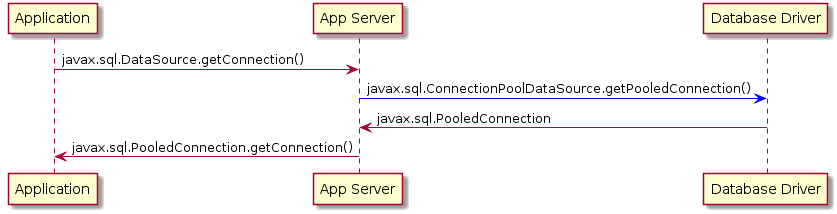
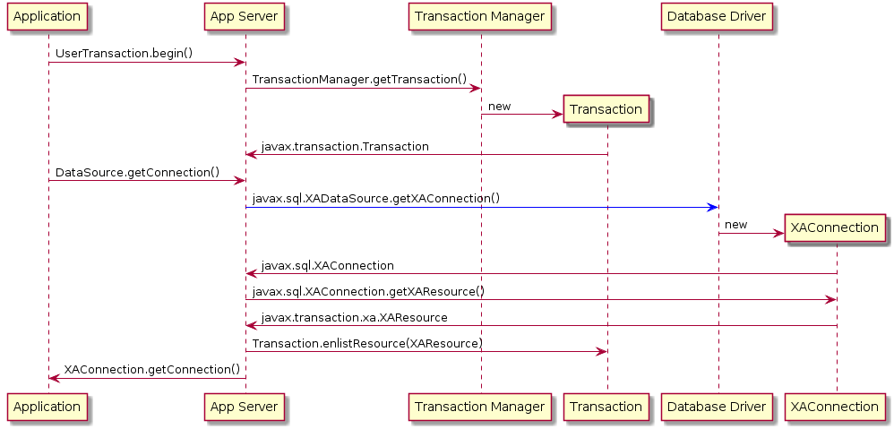

[[datasource-configuration]]
= JDBC Data Sources

Before going into technical details of Datasource configuration in OSGi runtime (like {f7}), let's review the common
mechanisms of Database connectivity in Java™ platform.

== Connections

The most important _object_ used to perform data manipulation is an implementation of `java.sql.Connection` interface.
We don't have to remind how to use this object, but from the perspective of {f7} configuration, it's important to
learn how to _obtain_ it.

The libraries that contain the objects I'm going to describe are:

* PostgreSQL: `mvn:org.postgresql/postgresql/42.2.2`
* MariaDB: `mvn:org.mariadb.jdbc/mariadb-java-client/2.2.4`
* MySQL: `mvn:mysql/mysql-connector-java/5.1.46`
* Derby: `mvn:org.apache.derby/derbyclient/10.14.2.0` and `mvn:org.apache.derby/derby/10.14.2.0` (for embedded driver)

If we check existing implementation (contained in _driver JARs_) we can find:

* PostgreSQL: `org.postgresql.jdbc.PgConnection`
* MariaDB: `org.mariadb.jdbc.MariaDbConnection`
* MySQL: `com.mysql.jdbc.JDBC4Connection` (see also different `connect*()` methods of `com.mysql.jdbc.Driver`)
* Derby (networked): `org.apache.derby.client.net.NetConnection` (for `jdbc:derby:net:*` or `jdbc:derby://`)
* Derby (embedded): `org.apache.derby.impl.jdbc.EmbedConnection` (for `jdbc:derby:*` or `jdbc:default:connection`)

These implementations contain database-specific logic to perform DML, DDL and simple transaction management.

In theory it's possible to manually create these connection objects, but there are two different JDBC methods that
hide the details and give cleaner API:

* `java.sql.Driver.connect()` - the method used in standalone applications long time ago
* `javax.sql.DataSource.getConnection()` - the preferred method using _factory_ pattern (note that similar method is
 used to obtain JMS connections from JMS connection factory. More about this later.)

We won't cover _driver manager_ approach here. It's enough to state that this method is just tiny _layer_ above
plain constructor of given connection object.

=== Other connection interfaces

In addition to `java.sql.Connection` (which effectively implements database-specific communication protocol),
there are two other specialized _connection_ interfaces:

* `javax.sql.PooledConnection` which _represents_ physical connection while users's code doesn't interact with this
pooled connection directly. Instead the connection obtained using `getConnection()` method is used. This indirection
enables management of connection pool at the level of application server. The connection obtained using `getConnection()`
is usually a proxy. When such proxy connection is closed, physical connection is not closed and instead it becomes
available again in the managed connection pool.

* `javax.sql.XAConnection` allows obtaining `javax.transaction.xa.XAResource` associated with XA-aware connection
for use with `javax.transaction.TransactionManager`. Because `javax.sql.XAConnection` extends `javax.sql.PooledConnection,
it also provides method `getConnection()` giving access to JDBC connection object with typical DML/DQL methods.

== JDBC Data sources

JDBC 1.4 standard introduced `javax.sql.DataSource` interface that acted as _factory_ for `java.sql.Connection`
objects. Usually such data sources where bound to JNDI registry and located inside or injected into Java EE
components like servlets or EJBs. The key aspect was that these datasources were *configured* inside _application server_
and *referenced* in deployed applications by name.

Two remaining _connection_ objects have their own _data sources_:

|===
|data source |connection

|`javax.sql.DataSource`
|`java.sql.Connection`

|`javax.sql.ConnectionPoolDataSource`
|`javax.sql.PooledConnection`

|`javax.sql.XADataSource`
|`javax.sql.XAConnection`
|===

It's worth emphasizing the most important differences between each of the above _data sources_:

* `javax.sql.DataSource` is most importantly a _factory_-like object to obtain `java.sql.Connection` instances.
The fact that most `javax.sql.DataSource` implementations usually perform _connection pooling_ should not
change the picture. This is the only interface that should be used by application code - whether it's direct JDBC
access, JPA persistence unit configuration (*either* `<jta-data-source>` or `<non-jta-data-source>`) or most of
the popular libraries (Apache Camel, Spring Framework, ...)
* `javax.sql.ConnectionPoolDataSource` is most importantly a _bridge_ between generic (non database-specific)
connection pool/data source and database-specific data source. It may be treated as SPI interface. Application
code usually deals with generic `javax.sql.DataSource` obtained from JNDI bound and implemented by application
server (probably using a library like commons-dbcp2). On the other end, application code doesn't deal with
`javax.sql.ConnectionPoolDataSource` directly - it's used between application server and database-specific driver.
This can be shown using this simple sequence diagram:
+
[plantuml]
....
Application -> "App Server": javax.sql.DataSource.getConnection()
"App Server" -[#0000FF]> "Database Driver": javax.sql.ConnectionPoolDataSource.getPooledConnection()
"Database Driver" -> "App Server": javax.sql.PooledConnection
"App Server" -> Application: javax.sql.PooledConnection.getConnection()
....

_if the diagram doesn't render, here's the image:_

* `javax.sql.XADataSource` is a way to obtain `javax.sql.XAConnection` and `javax.transaction.xa.XAResource`. Same as
`javax.sql.ConnectionPoolDataSource`, it's used between application server and database-specific driver. Here's
slightly modified diagram with different actors, this time including JTA Transaction Manager:
+
[plantuml]
....
Application -> "App Server": UserTransaction.begin()
"App Server" -> "Transaction Manager": TransactionManager.getTransaction()
create Transaction
"Transaction Manager" -> Transaction: new
"App Server" <- Transaction: javax.transaction.Transaction

Application -> "App Server": DataSource.getConnection()
"App Server" -[#0000FF]> "Database Driver": javax.sql.XADataSource.getXAConnection()
create XAConnection
"Database Driver" -> XAConnection: new
XAConnection -> "App Server": javax.sql.XAConnection

"App Server" -> XAConnection: javax.sql.XAConnection.getXAResource()
XAConnection -> "App Server": javax.transaction.xa.XAResource
"App Server" -> Transaction: Transaction.enlistResource(XAResource)

"App Server" -> Application: XAConnection.getConnection()
....

_if the diagram doesn't render, here's the image:_

As shown in two above diagrams, user interacts with _App Server_, which is generalized entity where we can configure
`javax.sql.DataSource` and `javax.transaction.UserTransaction` instances. Such instances may be
accessed either via JNDI or be injected using CDI or other DI mechanism.

[[application-only-needs-datasource]]
IMPORTANT: The important thing is that even if we (the application) use XA transactions and/or connection pooling, we
(the application) interact with `javax.sql.DataSource` and not the two other JDBC data source interfaces.

[[two-kinds-of-data-sources]]
=== Database specific and generic data sources

After the above introduction, we can separate JDBC data source implementations (of the three interfaces) into two
categories:

* generic `javax.sql.DataSource` implementations (like
http://commons.apache.org/proper/commons-dbcp/[Apache Commons DBCP(2)], Apache Tomcat JDBC (based on DBCP),
http://www.mchange.com/projects/c3p0/[C3P0], https://brettwooldridge.github.io/HikariCP[Hikari CP], ...)
* database specific implementations of `javax.sql.DataSource`, `javax.sql.XADataSource` and
`javax.sql.ConnectionPoolDataSource`

What probably creates some confusion is the fact that _generic_ `javax.sql.DataSource` implementation can't
create database-specific connections on its own. And even if such _generic_ data source may use `java.sql.Driver.connect()`
or `java.sql.DriverManager.getConnection()`, it's usually better/cleaner to configure this _generic_
data source with ... database-specific `javax.sql.DataSource` implementation.

When _generic_ data source is going to interact with JTA, it *has to* be configured with database-specific implementation
of `javax.sql.XADataSource`.

To close the picture, _generic_ data source usually *doesn't* need database-specific implementation of
`javax.sql.ConnectionPoolDataSource` in order to perform connection pooling - existing pools usually handle pooling
without standard JDBC interfaces (`javax.sql.ConnectionPoolDataSource` and `javax.sql.PooledConnection`) but using
own, custom implementation.

[[commons-dbcp2-standalone]]
=== Some generic data sources

Let's have a look at sample, well-known, generic data source,
http://commons.apache.org/proper/commons-dbcp/[Apache Commons DBCP(2)].

.javax.sql.XADataSource implementations

DBCP2 doesn't include any implementation of `javax.sql.XADataSource` which is expected.

.javax.sql.ConnectionPoolDataSource implementations

DBCP2 *does* include an implementation of `javax.sql.ConnectionPoolDataSource`:
`org.apache.commons.dbcp2.cpdsadapter.DriverAdapterCPDS`. It creates `javax.sql.PooledConnection`
objects using `java.sql.DriverManager.getConnection()` call. This pool should not be used directly and it should
be treated as an _adapter_ for drivers that:

* do not provide their own `javax.sql.ConnectionPoolDataSource` implementation, and
* we want to use according to JDBC _recommendation_ for connection pools

As mentioned in the sequence diagram above, the driver provides `javax.sql.ConnectionPoolDataSource` directly or with
the help of `org.apache.commons.dbcp2.cpdsadapter.DriverAdapterCPDS` _adapter_, while DBCP2 implements the
_application server_ contract with one of:

* `org.apache.commons.dbcp2.datasources.PerUserPoolDataSource`
* `org.apache.commons.dbcp2.datasources.SharedPoolDataSource`

Both these pools take an instance of `javax.sql.ConnectionPoolDataSource` at configuration stage.

But let's check the most important and interesting part of DBCP2:

.javax.sql.DataSource implementations

As mentioned previously - in order to implement connection pooling feature, we don't have to follow JDBC _recommendations_
to use `javax.sql.ConnectionPoolDataSource` → `javax.sql.PooledConnection` SPI.

Here is a list of _normal_ data sources of DBCP2:

* `org.apache.commons.dbcp2.BasicDataSource`
* `org.apache.commons.dbcp2.managed.BasicManagedDataSource`
* `org.apache.commons.dbcp2.PoolingDataSource`
* `org.apache.commons.dbcp2.managed.ManagedDataSource`

There are two _axes_ here:

._basic_ vs _pooling_

This _axis_ determines the _pooling configuration_ aspect.

Again, it's a bit confusing - both kinds of data sources perform _pooling_ of `java.sql.Connection` objects.
The *only* difference is that:

* _basic_ data source is configured using bean properties like `maxTotal` or `minIdle` used to configure internal
instance of `org.apache.commons.pool2.impl.GenericObjectPool`.
* _pooling_ data source is configured with externally created/configured `org.apache.commons.pool2.ObjectPool`.

._managed_ vs _non-managed_

This _axis_ determines the _connection creation_ aspect and JTA behavior.

_non-managed basic_ data source creates `java.sql.Connection` instances using `java.sql.Driver.connect()` internally.

_non-managed pooling_ data source creates `java.sql.Connection` instances using the passed `org.apache.commons.pool2.ObjectPool`.

_managed pooling_ data source wraps `java.sql.Connection` instances inside `org.apache.commons.dbcp2.managed.ManagedConnection`
objects that ensure `javax.transaction.Transaction.enlistResource()` call if needed in JTA context. But still the
actual connection that is wrapped is obtained from any `org.apache.commons.pool2.ObjectPool` the pool is configured with.

And finally, _managed basic_ data source frees user from configuring dedicated `org.apache.commons.pool2.ObjectPool`. Instead
it's enough to configure existing, real, database-specific `javax.sql.XADataSource`. Bean properties will be used to
create internal instance of `org.apache.commons.pool2.impl.GenericObjectPool` which is then passed to ... internal
instance of _managed pooling_ data source (`org.apache.commons.dbcp2.managed.ManagedDataSource`).

NOTE: The only thing that DBCP2 can't do is _XA transaction recovery_. DBCP2 correctly enlists XAResources in active
JTA transactions, but it's not performing the recovery. This should be done separately and the configuration is usually
specific to chosen Transaction Manager implementation (like http://narayana.io/[Narayana]).

=== Wrapping up

The recommended pattern is:

* create/obtain *database-specific* `javax.sql.DataSource` or `javax.sql.XADataSource` instance with database-specific
configuration (URL, credentials, ...) that knows how to create connections/XA connections,
* create/obtain *non database-specific* `javax.sql.DataSource` instance (internally configured with
the above, database-specific data source) with non database-specific configuration (connection pooling,
transaction manager, ...),
* use `javax.sql.DataSource` to get `java.sql.Connection` and perform JDBC operations.

[[canonical-datasource-example, Canonical DataSource example]]
Here's a _canonical_ example:

[source, java, options="nowrap"]
....
// database-specific, non-pooling, non-enlisting javax.sql.XADataSource
PGXADataSource postgresql = new org.postgresql.xa.PGXADataSource();
// database-specific configuration
postgresql.setUrl("jdbc:postgresql://localhost:5432/reportdb");
postgresql.setUser("fuse");
postgresql.setPassword("fuse");
postgresql.setCurrentSchema("report");
postgresql.setConnectTimeout(5);
// ...

// non database-specific, pooling, enlisting javax.sql.DataSource
BasicManagedDataSource pool = new org.apache.commons.dbcp2.managed.BasicManagedDataSource();
// delegate to database-specific XADatasource
pool.setXaDataSourceInstance(postgresql);
// delegate to JTA transaction manager
pool.setTransactionManager(transactionManager);
// non database-specific configuration
pool.setMinIdle(3);
pool.setMaxTotal(10);
pool.setValidationQuery("select schema_name, schema_owner from information_schema.schemata");
// ...

// JDBC code:
javax.sql.DataSource applicationDataSource = pool;

try (Connection c = applicationDataSource.getConnection()) {
    try (Statement st = c.createStatement()) {
        try (ResultSet rs = st.executeQuery("select ...")) {
            // ....
....

As we'll see later, in {f7} environment we have many configuration options and we're not even forced to use DBCP2.

[[datasource-configuration]]
= Datasource configuration

As we've seen in the section about <<osgi-transaction-architecture,OSGi transaction architecture>>,
we need some services to be registered in OSGi service registry. Just as we can _find_ (_lookup_) Transaction Manager
instance using for example `javax.transaction.UserTransaction` interface, we can do the same with JDBC data sources
using `javax.sql.DataSource` interface. We need:

* database-specific data source that knows how to communicate with target database
* generic data source where we can configure pooling and possibly transaction management (XA)

In OSGi environment, like {f7}, data sources become accessible from applications if they're registered as OSGi
services. Fundamentally, it's done using:

[source, java, options="nowrap"]
----
org.osgi.framework.BundleContext.registerService(javax.sql.DataSource.class,
                                                 dataSourceObject,
                                                 properties);
org.osgi.framework.BundleContext.registerService(javax.sql.XADataSource.class,
                                                 xaDataSourceObject,
                                                 properties);
----

There are two different methods to register such services:

* publishing data sources using `jdbc:ds-create` Karaf console command. We can call it _configuration method_.

* publishing data sources using methods like Blueprint, OSGi Declarative Services (SCR) or just
`BundleContext.registerService()` API call. This method requires dedicated OSGi bundle that contains the code and/or
metadata. We can call it _deployment method_.

== OSGi JDBC Service

Before going into details, let's present the OSGi way of handling data sources.

Chapter 125 of OSGi Enterprise R6 specification defines single interface in package `org.osgi.service.jdbc`:

[source, java, options="nowrap"]
----
public interface DataSourceFactory {

    java.sql.Driver createDriver(Properties props);

    javax.sql.DataSource createDataSource(Properties props);

    javax.sql.ConnectionPoolDataSource createConnectionPoolDataSource(Properties props);

    javax.sql.XADataSource createXADataSource(Properties props);
}
----

As mentioned before, plain `java.sql.Connection` connections may be obtained directly from `java.sql.Driver`.

.Generic org.osgi.service.jdbc.DataSourceFactory

The simplest implementation of `org.osgi.service.jdbc.DataSourceFactory` is
`org.ops4j.pax.jdbc.impl.DriverDataSourceFactory` provided by `mvn:org.ops4j.pax.jdbc/pax-jdbc/1.3.0` bundle. All it
does is tracking bundles that may include `/META-INF/services/java.sql.Driver` descriptor for standard Java™ _ServiceLoader_
utility. If we install any standard JDBC driver, `pax-jdbc` bundle will register a `DataSourceFactory` that can be used
(not directly) to obtain connections by means of `java.sql.Driver.connect()` call.

[literal, options="nowrap"]
----
karaf@root()> install -s mvn:org.osgi/org.osgi.service.jdbc/1.0.0
Bundle ID: 223
karaf@root()> install -s mvn:org.ops4j.pax.jdbc/pax-jdbc/1.3.0
Bundle ID: 224
karaf@root()> install -s mvn:org.postgresql/postgresql/42.2.2
Bundle ID: 225
karaf@root()> install -s mvn:mysql/mysql-connector-java/5.1.46
Bundle ID: 226

karaf@root()> bundle:services -p org.postgresql.jdbc42

PostgreSQL JDBC Driver JDBC42 (225) provides:
---------------------------------------------
objectClass = [org.osgi.service.jdbc.DataSourceFactory]
osgi.jdbc.driver.class = org.postgresql.Driver
osgi.jdbc.driver.name = PostgreSQL JDBC Driver
osgi.jdbc.driver.version = 42.2.2
service.bundleid = 225
service.id = 242
service.scope = singleton

karaf@root()> bundle:services -p com.mysql.jdbc

Oracle Corporation's JDBC Driver for MySQL (226) provides:
----------------------------------------------------------
objectClass = [org.osgi.service.jdbc.DataSourceFactory]
osgi.jdbc.driver.class = com.mysql.jdbc.Driver
osgi.jdbc.driver.name = com.mysql.jdbc
osgi.jdbc.driver.version = 5.1.46
service.bundleid = 226
service.id = 243
service.scope = singleton
-----
objectClass = [org.osgi.service.jdbc.DataSourceFactory]
osgi.jdbc.driver.class = com.mysql.fabric.jdbc.FabricMySQLDriver
osgi.jdbc.driver.name = com.mysql.jdbc
osgi.jdbc.driver.version = 5.1.46
service.bundleid = 226
service.id = 244
service.scope = singleton

karaf@root()> service:list org.osgi.service.jdbc.DataSourceFactory
[org.osgi.service.jdbc.DataSourceFactory]
-----------------------------------------
 osgi.jdbc.driver.class = org.postgresql.Driver
 osgi.jdbc.driver.name = PostgreSQL JDBC Driver
 osgi.jdbc.driver.version = 42.2.2
 service.bundleid = 225
 service.id = 242
 service.scope = singleton
Provided by :
 PostgreSQL JDBC Driver JDBC42 (225)

[org.osgi.service.jdbc.DataSourceFactory]
-----------------------------------------
 osgi.jdbc.driver.class = com.mysql.jdbc.Driver
 osgi.jdbc.driver.name = com.mysql.jdbc
 osgi.jdbc.driver.version = 5.1.46
 service.bundleid = 226
 service.id = 243
 service.scope = singleton
Provided by :
 Oracle Corporation's JDBC Driver for MySQL (226)

[org.osgi.service.jdbc.DataSourceFactory]
-----------------------------------------
 osgi.jdbc.driver.class = com.mysql.fabric.jdbc.FabricMySQLDriver
 osgi.jdbc.driver.name = com.mysql.jdbc
 osgi.jdbc.driver.version = 5.1.46
 service.bundleid = 226
 service.id = 244
 service.scope = singleton
Provided by :
 Oracle Corporation's JDBC Driver for MySQL (226)
----

With the above commands, we still don't have `javax.sql.DataSource` service registered, but we're one step closer.
The above intermediary `org.osgi.service.jdbc.DataSourceFactory` services can be used to obtain:

* `java.sql.Driver`
* `javax.sql.DataSource` by passing properties: `url`, `user` and `password` to `createDataSource()` method.

We can't obtain `javax.sql.ConnectionPoolDataSource` or `javax.sql.XADataSource` from the generic
`org.osgi.service.jdbc.DataSourceFactory` created by non database-specific `pax-jdbc` bundle.

NOTE: `mvn:org.postgresql/postgresql/42.2.2` bundle correctly implements OSGi JDBC specification and registers
an `org.osgi.service.jdbc.DataSourceFactory` with all methods implemented - also the ones creating XA and ConnectionPool
data sources.

.Dedicated, database-specific org.osgi.service.jdbc.DataSourceFactory implementations

There are additional bundles like:

* `mvn:org.ops4j.pax.jdbc/pax-jdbc-mysql/1.3.0`
* `mvn:org.ops4j.pax.jdbc/pax-jdbc-mariadb/1.3.0`
* `mvn:org.ops4j.pax.jdbc/pax-jdbc-db2/1.3.0`
* ...

that register database-specific `org.osgi.service.jdbc.DataSourceFactory` services that can return all kinds of
_factories_ (including `javax.sql.ConnectionPoolDataSource` and `javax.sql.XADataSource`). For example:

[literal, options="nowrap"]
----
karaf@root()> install -s mvn:org.ops4j.pax.jdbc/pax-jdbc-mysql/1.3.0
Bundle ID: 227

karaf@root()> bundle:services -p org.ops4j.pax.jdbc.mysql

OPS4J Pax JDBC MySQL Driver Adapter (227) provides:
---------------------------------------------------
objectClass = [org.osgi.service.jdbc.DataSourceFactory]
osgi.jdbc.driver.class = com.mysql.jdbc.Driver
osgi.jdbc.driver.name = mysql
service.bundleid = 227
service.id = 245
service.scope = singleton

karaf@root()> service:list org.osgi.service.jdbc.DataSourceFactory
...
[org.osgi.service.jdbc.DataSourceFactory]
-----------------------------------------
 osgi.jdbc.driver.class = com.mysql.jdbc.Driver
 osgi.jdbc.driver.name = mysql
 service.bundleid = 227
 service.id = 245
 service.scope = singleton
Provided by :
 OPS4J Pax JDBC MySQL Driver Adapter (227)
----

[[pax-jdbc-config]]
== PAX-JDBC configuration service

With `pax-jdbc` (or `pax-jdbc-mysql`, `pax-jdbc-oracle`, ...) bundles, we can have `org.osgi.service.jdbc.DataSourceFactory`
services registered that can be used to obtain datasources for given database (see <<two-kinds-of-data-sources>>). But
we don't have actual datasources yet.

`mvn:org.ops4j.pax.jdbc/pax-jdbc-config/1.3.0` bundle provides a Managed Service Factory
that does two things:

* tracks `org.osgi.service.jdbc.DataSourceFactory` OSGi services in order to invoke its methods:
+
[source,java,options="nowrap"]
....
public DataSource createDataSource(Properties props);
public XADataSource createXADataSource(Properties props);
public ConnectionPoolDataSource createConnectionPoolDataSource(Properties props);
....
* tracks `org.ops4j.datasource` _factory PIDs_ in order to collect properties required by the above methods.
If we create a _factory configuration_ using any method available for Configuration Admin service, for example by
creating `${karaf.etc}/org.ops4j.datasource-mysql.cfg` file, we can perform the final step to expose actual
database-specific data source.

[[canonical-pax-jdbc-config-example]]
Here's the detailed, _canonical_ step-by-step guide (starting from fresh {f7}).

NOTE: we explicitly install bundles instead of features, to show exactly which bundles are needed. For convenience,
PAX JDBC project provides features for several database products and configuration approaches.

. Install JDBC driver with `/META-INF/services/java.sql.Driver`:
+
[listing,options="nowrap"]
----
karaf@root()> install -s mvn:mysql/mysql-connector-java/5.1.46
Bundle ID: 223
----

. Install OSGi JDBC service bundle and `pax-jdbc-mysql` bundle that registers _intermediary_
`org.osgi.service.jdbc.DataSourceFactory`:
+
[listing,options="nowrap"]
----
karaf@root()> install -s mvn:org.osgi/org.osgi.service.jdbc/1.0.0
Bundle ID: 224
karaf@root()> install -s mvn:org.ops4j.pax.jdbc/pax-jdbc-mysql/1.3.0
Bundle ID: 225

karaf@root()> service:list org.osgi.service.jdbc.DataSourceFactory
[org.osgi.service.jdbc.DataSourceFactory]
-----------------------------------------
 osgi.jdbc.driver.class = com.mysql.jdbc.Driver
 osgi.jdbc.driver.name = mysql
 service.bundleid = 225
 service.id = 242
 service.scope = singleton
Provided by :
 OPS4J Pax JDBC MySQL Driver Adapter (225)
----

. Install `pax-jdbc` and `pax-jdbc-config` bundle that tracks `org.osgi.service.jdbc.DataSourceFactory` services *and*
`org.ops4j.datasource` _factory PIDs_:
+
[listing,options="nowrap"]
----
karaf@root()> install -s mvn:org.ops4j.pax.jdbc/pax-jdbc/1.3.0
Bundle ID: 226
karaf@root()> install -s mvn:org.ops4j.pax.jdbc/pax-jdbc-pool-common/1.3.0
Bundle ID: 227
karaf@root()> install -s mvn:org.ops4j.pax.jdbc/pax-jdbc-config/1.3.0
Bundle ID: 228

karaf@root()> bundle:services -p org.ops4j.pax.jdbc.config

OPS4J Pax JDBC Config (228) provides:
-------------------------------------
objectClass = [org.osgi.service.cm.ManagedServiceFactory]
service.bundleid = 228
service.id = 245
service.pid = org.ops4j.datasource
service.scope = singleton
----

. Create _factory configuration_ (assuming we have MySQL server running):
+
[listing,options="nowrap"]
----
karaf@root()> config:edit --factory --alias mysql org.ops4j.datasource
karaf@root()> config:property-set osgi.jdbc.driver.name mysql
karaf@root()> config:property-set dataSourceName mysqlds
karaf@root()> config:property-set url jdbc:mysql://localhost:3306/reportdb
karaf@root()> config:property-set user fuse
karaf@root()> config:property-set password fuse
karaf@root()> config:update

karaf@root()> config:list '(service.factoryPid=org.ops4j.datasource)'
----------------------------------------------------------------
Pid:            org.ops4j.datasource.a7941498-9b62-4ed7-94f3-8c7ac9365313
FactoryPid:     org.ops4j.datasource
BundleLocation: ?
Properties:
   dataSourceName = mysqlds
   felix.fileinstall.filename = file:${karaf.etc}/org.ops4j.datasource-mysql.cfg
   osgi.jdbc.driver.name = mysql
   password = fuse
   service.factoryPid = org.ops4j.datasource
   service.pid = org.ops4j.datasource.a7941498-9b62-4ed7-94f3-8c7ac9365313
   url = jdbc:mysql://localhost:3306/reportdb
   user = fuse
----

. Check if `pax-jdbc-config` processed the configuration into `javax.sql.DataSource` service:
+
[listing,options="nowrap"]
----
karaf@root()> service:list javax.sql.DataSource
[javax.sql.DataSource]
----------------------
 dataSourceName = mysqlds
 felix.fileinstall.filename = file:${karaf.etc}/org.ops4j.datasource-mysql.cfg
 osgi.jdbc.driver.name = mysql
 osgi.jndi.service.name = mysqlds
 password = fuse
 pax.jdbc.managed = true
 service.bundleid = 228
 service.factoryPid = org.ops4j.datasource
 service.id = 246
 service.pid = org.ops4j.datasource.a7941498-9b62-4ed7-94f3-8c7ac9365313
 service.scope = singleton
 url = jdbc:mysql://localhost:3306/reportdb
 user = fuse
Provided by :
 OPS4J Pax JDBC Config (228)
----

Now we have actual database-specific (no pooling yet) data source. We can already inject it where needed. For example we can
use Karaf commands to query the database:
[listing,options="nowrap"]
----
karaf@root()> feature:install -v jdbc
Adding features: jdbc/[4.2.0.fuse-000237-redhat-1,4.2.0.fuse-000237-redhat-1]
...
karaf@root()> jdbc:ds-list
Mon May 14 08:46:22 CEST 2018 WARN: Establishing SSL connection without server's identity verification is not recommended. According to MySQL 5.5.45+, 5.6.26+ and 5.7.6+ requirements SSL connection must be established by default if explicit option isn't set. For compliance with existing applications not using SSL the verifyServerCertificate property is set to 'false'. You need either to explicitly disable SSL by setting useSSL=false, or set useSSL=true and provide truststore for server certificate verification.
Name    │ Product │ Version │ URL                                  │ Status
────────┼─────────┼─────────┼──────────────────────────────────────┼───────
mysqlds │ MySQL   │ 5.7.21  │ jdbc:mysql://localhost:3306/reportdb │ OK

karaf@root()> jdbc:query mysqlds 'select * from incident'
Mon May 14 08:46:46 CEST 2018 WARN: Establishing SSL connection without server's identity verification is not recommended. According to MySQL 5.5.45+, 5.6.26+ and 5.7.6+ requirements SSL connection must be established by default if explicit option isn't set. For compliance with existing applications not using SSL the verifyServerCertificate property is set to 'false'. You need either to explicitly disable SSL by setting useSSL=false, or set useSSL=true and provide truststore for server certificate verification.
date                  │ summary    │ name   │ details                       │ id │ email
──────────────────────┼────────────┼────────┼───────────────────────────────┼────┼─────────────────
2018-02-20 08:00:00.0 │ Incident 1 │ User 1 │ This is a report incident 001 │ 1  │ user1@redhat.com
2018-02-20 08:10:00.0 │ Incident 2 │ User 2 │ This is a report incident 002 │ 2  │ user2@redhat.com
2018-02-20 08:20:00.0 │ Incident 3 │ User 3 │ This is a report incident 003 │ 3  │ user3@redhat.com
2018-02-20 08:30:00.0 │ Incident 4 │ User 4 │ This is a report incident 004 │ 4  │ user4@redhat.com
----

In the above case we see some MySQL warning. No problem. Any property (not only OSGi JDBC specific ones) may be provided:

[listing,options="nowrap"]
----
karaf@root()> config:property-set --pid org.ops4j.datasource.a7941498-9b62-4ed7-94f3-8c7ac9365313 useSSL false

karaf@root()> jdbc:ds-list
Name    │ Product │ Version │ URL                                  │ Status
────────┼─────────┼─────────┼──────────────────────────────────────┼───────
mysqlds │ MySQL   │ 5.7.21  │ jdbc:mysql://localhost:3306/reportdb │ OK
----

=== Summary of handled properties

Properties from configuration admin _factory PID_ are passed to relevant `org.osgi.service.jdbc.DataSourceFactory`
implementation.

.Generic org.ops4j.pax.jdbc.impl.DriverDataSourceFactory
* `url`
* `user`
* `password`

.DB2 - org.ops4j.pax.jdbc.db2.impl.DB2DataSourceFactory
* all bean properties of these implementation classes: `com.ibm.db2.jcc.DB2SimpleDataSource`,
`com.ibm.db2.jcc.DB2ConnectionPoolDataSource`, `com.ibm.db2.jcc.DB2XADataSource`

.PostgreSQL - native org.postgresql.osgi.PGDataSourceFactory
* all properties specified in `org.postgresql.PGProperty`

.Derby - org.ops4j.pax.jdbc.derby.impl.DerbyDataSourceFactory
* `databaseName`
* `createDatabase`
* `url`
* `user`
* `password`
* all bean properties of `org.apache.derby.jdbc.EmbeddedDataSource`,
`org.apache.derby.jdbc.EmbeddedConnectionPoolDataSource` or `org.apache.derby.jdbc.EmbeddedXADataSource`

.Derby - org.ops4j.pax.jdbc.derbyclient.impl.DerbyClientDatasourceFactory
* `databaseName`
* `serverName`
* `portNumber`
* `createDatabase`
* `url`
* `user`
* `password`
* all bean properties of `org.apache.derby.jdbc.ClientDataSource`,
`org.apache.derby.jdbc.ClientConnectionPoolDataSource` or `org.apache.derby.jdbc.ClientXADataSource`

.HSQLDB - org.ops4j.pax.jdbc.hsqldb.impl.HsqldbDataSourceFactory
* `url`
* `user`
* `password`
* `databaseName`
* all bean properties of `org.hsqldb.jdbc.JDBCDataSource`,
`org.hsqldb.jdbc.pool.JDBCPooledDataSource` or `org.hsqldb.jdbc.pool.JDBCXADataSource`

.SQL Server and Sybase - org.ops4j.pax.jdbc.jtds.impl.JTDSDataSourceFactory
* all bean properties of `net.sourceforge.jtds.jdbcx.JtdsDataSource`

.MariaDB - org.ops4j.pax.jdbc.mariadb.impl.MariaDbDataSourceFactory
* `url`
* `user`
* `password`
* `databaseName`
* `serverName`
* `portNumber`
* all bean properties of `org.mariadb.jdbc.MariaDbDataSource`

.SQL Server - org.ops4j.pax.jdbc.mssql.impl.MSSQLDataSourceFactory
* `url`
* `user`
* `password`
* `databaseName`
* `serverName`
* `portNumber`
* all bean properties of `com.microsoft.sqlserver.jdbc.SQLServerDataSource`,
`com.microsoft.sqlserver.jdbc.SQLServerConnectionPoolDataSource`, or `com.microsoft.sqlserver.jdbc.SQLServerXADataSource`

.MySQL - org.ops4j.pax.jdbc.mysql.impl.MysqlDataSourceFactory
* `url`
* `user`
* `password`
* `databaseName`
* `serverName`
* `portNumber`
* all bean properties of `com.mysql.jdbc.jdbc2.optional.MysqlDataSource`,
`com.mysql.jdbc.jdbc2.optional.MysqlConnectionPoolDataSource` or `com.mysql.jdbc.jdbc2.optional.MysqlXADataSource`

.Oracle - org.ops4j.pax.jdbc.oracle.impl.OracleDataSourceFactory
* `url`
* `databaseName`
* `serverName`
* `user`
* `password`
* all bean properties of `oracle.jdbc.pool.OracleDataSource`,
`oracle.jdbc.pool.OracleConnectionPoolDataSource` or `oracle.jdbc.xa.client.OracleXADataSource`

.SQLite - org.ops4j.pax.jdbc.sqlite.impl.SqliteDataSourceFactory
* `url`
* `databaseName`
* all bean properties of `org.sqlite.SQLiteDataSource`

=== Useful convention

`pax-jdbc-config` bundle handles properties prefixed with `jdbc.` - all these properties will have this prefix
removed and remaining names will be passed over.

Here's the example (again, starting with fresh {f7}:

[listing,options="nowrap"]
----
karaf@root()> install -s mvn:mysql/mysql-connector-java/5.1.46
Bundle ID: 223
karaf@root()> install -s mvn:org.osgi/org.osgi.service.jdbc/1.0.0
Bundle ID: 224
karaf@root()> install -s mvn:org.ops4j.pax.jdbc/pax-jdbc-mysql/1.3.0
Bundle ID: 225
karaf@root()> install -s mvn:org.ops4j.pax.jdbc/pax-jdbc/1.3.0
Bundle ID: 226
karaf@root()> install -s mvn:org.ops4j.pax.jdbc/pax-jdbc-pool-common/1.3.0
Bundle ID: 227
karaf@root()> install -s mvn:org.ops4j.pax.jdbc/pax-jdbc-config/1.3.0
Bundle ID: 228

karaf@root()> config:edit --factory --alias mysql org.ops4j.datasource
karaf@root()> config:property-set osgi.jdbc.driver.name mysql
karaf@root()> config:property-set dataSourceName mysqlds
karaf@root()> config:property-set dataSourceType DataSource
karaf@root()> config:property-set jdbc.url jdbc:mysql://localhost:3306/reportdb
karaf@root()> config:property-set jdbc.user fuse
karaf@root()> config:property-set jdbc.password fuse
karaf@root()> config:property-set jdbc.useSSL false
karaf@root()> config:update

karaf@root()> config:list '(service.factoryPid=org.ops4j.datasource)'
----------------------------------------------------------------
Pid:            org.ops4j.datasource.7c3ee718-7309-46a0-ae3a-64b38b17a0a3
FactoryPid:     org.ops4j.datasource
BundleLocation: ?
Properties:
   dataSourceName = mysqlds
   dataSourceType = DataSource
   felix.fileinstall.filename = file:/data/servers/fuse-karaf-7.0.0.fuse-000191-redhat-1/etc/org.ops4j.datasource-mysql.cfg
   jdbc.password = fuse
   jdbc.url = jdbc:mysql://localhost:3306/reportdb
   jdbc.useSSL = false
   jdbc.user = fuse
   osgi.jdbc.driver.name = mysql
   service.factoryPid = org.ops4j.datasource
   service.pid = org.ops4j.datasource.7c3ee718-7309-46a0-ae3a-64b38b17a0a3

karaf@root()> service:list javax.sql.DataSource
[javax.sql.DataSource]
----------------------
 dataSourceName = mysqlds
 dataSourceType = DataSource
 felix.fileinstall.filename = file:${karaf.etc}/org.ops4j.datasource-mysql.cfg
 jdbc.password = fuse
 jdbc.url = jdbc:mysql://localhost:3306/reportdb
 jdbc.user = fuse
 jdbc.useSSL = false
 osgi.jdbc.driver.name = mysql
 osgi.jndi.service.name = mysqlds
 pax.jdbc.managed = true
 service.bundleid = 228
 service.factoryPid = org.ops4j.datasource
 service.id = 246
 service.pid = org.ops4j.datasource.7c3ee718-7309-46a0-ae3a-64b38b17a0a3
 service.scope = singleton
Provided by :
 OPS4J Pax JDBC Config (228)
----

Properties `osgi.jdbc.driver.name`, `dataSourceName` and `dataSourceType` are required by `pax-jdbc-config` itself to
locate and invoke relevant `org.osgi.service.jdbc.DataSourceFactory`, properties prefixed with `jdbc.` are passed
(after removing the prefix) to e.g., `org.osgi.service.jdbc.DataSourceFactory.createDataSource(properties)`, but are
added without the prefix removed as properties of e.g., `javax.sql.DataSource` OSGi service.

== Using console commands

{f7} provides `jdbc` feature that includes shell commands in the `jdbc:*` scope. We already tried `jdbc:query`,
but there are also commands that hide the need to create Configuration Admin configs.

We could register database-specific data source using (starting with fresh instance of {f7}):

.Install `jdbc` feature with generic DataSourceFactory service
[listing,options="nowrap"]
----
karaf@root()> feature:install jdbc

karaf@root()> jdbc:ds-factories
Name │ Class │ Version
─────┼───────┼────────

karaf@root()> install -s mvn:mysql/mysql-connector-java/5.1.46
Bundle ID: 228

karaf@root()> jdbc:ds-factories
Name           │ Class                                   │ Version
───────────────┼─────────────────────────────────────────┼────────
com.mysql.jdbc │ com.mysql.jdbc.Driver                   │ 5.1.46
com.mysql.jdbc │ com.mysql.fabric.jdbc.FabricMySQLDriver │ 5.1.46
----

.Install MySQL-specific DataSourceFactory service
[listing,options="nowrap"]
----
karaf@root()> feature:repo-add mvn:org.ops4j.pax.jdbc/pax-jdbc-features/1.3.0/xml/features-gpl
Adding feature url mvn:org.ops4j.pax.jdbc/pax-jdbc-features/1.3.0/xml/features-gpl

karaf@root()> feature:install pax-jdbc-mysql

karaf@root()> jdbc:ds-factories
Name           │ Class                                   │ Version
───────────────┼─────────────────────────────────────────┼────────
com.mysql.jdbc │ com.mysql.jdbc.Driver                   │ 5.1.46
mysql          │ com.mysql.jdbc.Driver                   │
com.mysql.jdbc │ com.mysql.fabric.jdbc.FabricMySQLDriver │ 5.1.46
----

The above table may be confusing, but as mentioned above, only one of `pax-jdbc-<database>` bundles may register
`org.osgi.service.jdbc.DataSourceFactory` instances that can create standard/XA/connection pool data sources that do *not*
simply delegate to `java.sql.Driver.connect()`.

.Create and check MySQL data source
[listing,options="nowrap"]
----
karaf@root()> jdbc:ds-create -dt DataSource -dn mysql -url 'jdbc:mysql://localhost:3306/reportdb?useSSL=false' -u fuse -p fuse mysqlds

karaf@root()> jdbc:ds-list
Name    │ Product │ Version │ URL                                               │ Status
────────┼─────────┼─────────┼───────────────────────────────────────────────────┼───────
mysqlds │ MySQL   │ 5.7.21  │ jdbc:mysql://localhost:3306/reportdb?useSSL=false │ OK

karaf@root()> jdbc:query mysqlds 'select * from incident'
date                  │ summary    │ name   │ details                       │ id │ email
──────────────────────┼────────────┼────────┼───────────────────────────────┼────┼─────────────────
2018-02-20 08:00:00.0 │ Incident 1 │ User 1 │ This is a report incident 001 │ 1  │ user1@redhat.com
2018-02-20 08:10:00.0 │ Incident 2 │ User 2 │ This is a report incident 002 │ 2  │ user2@redhat.com
2018-02-20 08:20:00.0 │ Incident 3 │ User 3 │ This is a report incident 003 │ 3  │ user3@redhat.com
2018-02-20 08:30:00.0 │ Incident 4 │ User 4 │ This is a report incident 004 │ 4  │ user4@redhat.com

karaf@root()> config:list '(service.factoryPid=org.ops4j.datasource)'
----------------------------------------------------------------
Pid:            org.ops4j.datasource.55b18993-de4e-4e0b-abb2-a4c13da7f78b
FactoryPid:     org.ops4j.datasource
BundleLocation: mvn:org.ops4j.pax.jdbc/pax-jdbc-config/1.3.0
Properties:
   dataSourceName = mysqlds
   dataSourceType = DataSource
   osgi.jdbc.driver.name = mysql
   password = fuse
   service.factoryPid = org.ops4j.datasource
   service.pid = org.ops4j.datasource.55b18993-de4e-4e0b-abb2-a4c13da7f78b
   url = jdbc:mysql://localhost:3306/reportdb?useSSL=false
   user = fuse
----

As we can see, `org.ops4j.datasource` factory PID was created for us. However it's not automatically stored in
`${karaf.etc}`, which is possible with `config:update`.

== Using encrypted configuration values

`pax-jdbc-config` is able to process Configuration Admin configurations where values are encrypted. Popular solution
is to use Jasypt encryption services (used also by Blueprint).

If there's any `org.jasypt.encryption.StringEncryptor` service registered in OSGi with any `alias` service property,
we can refrence it in datasource _factory PID_ and use encrypted passwords. Here's an example:
[listing,options="nowrap"]
----
felix.fileinstall.filename = */etc/org.ops4j.datasource-mysql.cfg
dataSourceName = mysqlds
dataSourceType = DataSource
decryptor = my-jasypt-decryptor
osgi.jdbc.driver.name = mysql
url = jdbc:mysql://localhost:3306/reportdb?useSSL=false
user = fuse
password = ENC(<encrypted-password>)
----

The service filter used to find decryptor service is `(&(objectClass=org.jasypt.encryption.StringEncryptor)(alias=<alias>))`,
where `<alias>` is the value of `decryptor` property from data source configuration _factory PID_.

[[jdbc-connection-pools]]
== Using connection pools

IMPORTANT: This chapter presents exhaustive information on the internals of data source management.
DBCP2 connection pool is presented, but please remember that this connection pool doesn't provide XA Recovery
options. It provides proper JTA enlisting capabilities, but no XA Recovery.

IMPORTANT: In order to use XA recovery, `pax-jdbc-pool-transx` or `pax-jdbc-pool-narayana` should be used.

So far we've registered database-specific data source *factory* (because _data source_ itself is a factory for connections,
`org.osgi.service.jdbc.DataSourceFactory` may be treated as _meta factory_) that should be able to produce
3 kinds of data sources (plus, as a bonus, a `java.sql.Driver`):

* `javax.sql.DataSource`
* `javax.sql.ConnectionPoolDataSource`
* `javax.sql.XADataSource`

For example, `pax-jdbc-mysql` registers a `org.ops4j.pax.jdbc.mysql.impl.MysqlDataSourceFactory` which produces:

* `javax.sql.DataSource` → `com.mysql.jdbc.jdbc2.optional.MysqlDataSource`
* `javax.sql.ConnectionPoolDataSource` → `com.mysql.jdbc.jdbc2.optional.MysqlConnectionPoolDataSource`
* `javax.sql.XADataSource` → `com.mysql.jdbc.jdbc2.optional.MysqlXADataSource`
* `java.sql.Driver` → `com.mysql.jdbc.Driver`

PostgreSQL driver itself implements OSGi JDBC service and produces:

* `javax.sql.DataSource` → `org.postgresql.jdbc2.optional.PoolingDataSource` (if there are pool-related properties specified)
 or `org.postgresql.jdbc2.optional.SimpleDataSource`
* `javax.sql.ConnectionPoolDataSource` → `org.postgresql.jdbc2.optional.ConnectionPool`
* `javax.sql.XADataSource` → `org.postgresql.xa.PGXADataSource`
* `java.sql.Driver` → `org.postgresql.Driver`

As shown in <<canonical-datasource-example>>, any _pooling_, _generic_ data source, if it's going to
work in JTA environment, needs _database specific_ data source to actually obtain (XA) connections.

We already have the latter, and we need actual, generic, reliable connection pool.

The <<canonical-datasource-example>> shows how to configure generic pool with database-specific data source.
`pax-jdbc-pool-*` bundles work smoothly with the above described `org.osgi.service.jdbc.DataSourceFactory`
services.

Just as OSGI Enterprise R6 JDBC specification provides `org.osgi.service.jdbc.DataSourceFactory` standard interface,
`pax-jdbc-pool-common` provides _proprietary_ `org.ops4j.pax.jdbc.pool.common.PooledDataSourceFactory` interface:

[source, java, options="nowrap"]
----
public interface PooledDataSourceFactory {

    javax.sql.DataSource create(org.osgi.service.jdbc.DataSourceFactory dsf, Properties config)

}
----

This interface is perfectly conformant with what we've <<application-only-needs-datasource,already wrote>>:

IMPORTANT: The important thing is that even if we (the application) use XA transactions and/or connection pooling, we
(the application) interact with `javax.sql.DataSource` and not the two other JDBC data source interfaces.

This interface simply creates a pooling data source out of database-specific, non-pooling datasource. Or more precisely,
it is a _data source factory_ (_meta factory_) that turns a factory of database-specific data sources into a factory
of pooling data sources.

NOTE: Of course nothing can stop us from configuring pooling `javax.sql.DataSource` using `org.osgi.service.jdbc.DataSourceFactory`
service that already returns pooling `javax.sql.DataSource`, but that's the part of developer's freedom.

Which bundles register pooled data source factories (`o.o.p.j.p` == `org.ops4j.pax.jdbc.pool`)?

|===
|Bundle |PooledDataSourceFactory |pool key

|`pax-jdbc-pool-narayana`
|`o.o.p.j.p.narayana.impl.Dbcp(XA)PooledDataSourceFactory`
|`narayana`

|`pax-jdbc-pool-c3p0`
|`o.o.p.j.p.c3p0.impl.ds.C3p0(XA)PooledDataSourceFactory`
|`c3p0`

|`pax-jdbc-pool-dbcp2`
|`o.o.p.j.p.dbcp2.impl.Dbcp(XA)PooledDataSourceFactory`
|`dbcp2`

|`pax-jdbc-pool-aries`
|`o.o.p.j.p.aries.impl.Aries(Xa)PooledDataSourceFactory`
|`aries`

|`pax-jdbc-pool-hikaricp`
|`o.o.p.j.p.hikaricp.impl.HikariPooledDataSourceFactory` (no XA version)
|`hikari`

|`pax-jdbc-pool-transx`
|`o.o.p.j.p.transx.impl.Transx(Xa)PooledDataSourceFactory`
|`transx`
|===

The above bundles only install data source factories. Not the data sources themselves. So again we need something
that'll actually call `javax.sql.DataSource create(org.osgi.service.jdbc.DataSourceFactory dsf, Properties config)` method.

=== pax-jdbc-pool-dbcp2

We've <<commons-dbcp2-standalone,already seen>> how to use and configure http://commons.apache.org/proper/commons-dbcp/[Apache Commons DBCP].
This time we'll do it in OSGi environment like {f7}.

<<pax-jdbc-config,pax-jdbc-config>> bundle in addition to tracking:

* `org.osgi.service.jdbc.DataSourceFactory` services
* `org.ops4j.datasource` _factory PIDs_

also tracks instances of `org.ops4j.pax.jdbc.pool.common.PooledDataSourceFactory` registered by one of `pax-jdbc-pool-*` bundles.

If _factory configuration_ contains `pool` property, the ultimate data source registered by `pax-jdbc-config` bundle
will be the database-specific datasource, but wrapped inside one of (if `pool=dbcp2`):

* `org.apache.commons.dbcp2.PoolingDataSource`
* `org.apache.commons.dbcp2.managed.ManagedDataSource`

This is perfectly consistent with what <<commons-dbcp2-standalone,we did manually before>>. Besides `pool` property
(and boolean `xa` property, which selects one of non-xa/xa data sources), `org.ops4j.datasource` _factory PID_ may contain
_prefixed_ properties:

* `pool.*`
* `factory.*`

Where each of the properties are used depends on `pax-jdbc-pool-*` bundle used. For dbcp2 it is:

* `pool.*`: bean properties of `org.apache.commons.pool2.impl.GenericObjectPoolConfig` (both xa and non-xa scenario)
* `factory.*`: bean properties of `org.apache.commons.dbcp2.managed.PoolableManagedConnectionFactory` (xa) or
 `org.apache.commons.dbcp2.PoolableConnectionFactory` (non-xa)

Here's quite realistic (except `useSSL=false`) configuration of dbcp2 pool (`org.ops4j.datasource-mysql` _factory PID_)
using convenient syntax with `jdbc.`-prefixed properties:

[listing, options="nowrap"]
----
# configuration for pax-jdbc-config to choose and configure specific org.osgi.service.jdbc.DataSourceFactory
dataSourceName = mysqlds
dataSourceType = DataSource
osgi.jdbc.driver.name = mysql
jdbc.url = jdbc:mysql://localhost:3306/reportdb
jdbc.user = fuse
jdbc.password = fuse
jdbc.useSSL = false

# hints for pax-jdbc-config to use org.ops4j.pax.jdbc.pool.common.PooledDataSourceFactory
pool = dbcp2
xa = false

# dbcp2 specific configuration of org.apache.commons.pool2.impl.GenericObjectPoolConfig
pool.minIdle = 10
pool.maxTotal = 100
pool.blockWhenExhausted = true
pool.maxWaitMillis = 2000
pool.testOnBorrow = true
pool.testWhileIdle = false
pool.timeBetweenEvictionRunsMillis = 120000
pool.evictionPolicyClassName = org.apache.commons.pool2.impl.DefaultEvictionPolicy

# dbcp2 specific configuration of org.apache.commons.dbcp2.PoolableConnectionFactory
factory.maxConnLifetimeMillis = 30000
factory.validationQuery  = select schema_name from information_schema.schemata
factory.validationQueryTimeout = 2
----

In the above configuration, `pool` and `xa` keys are _hints_ (service filter properties) to choose one of registered
`org.ops4j.pax.jdbc.pool.common.PooledDataSourceFactory` services. In case of dbcp2 it's:
[listing, options="nowrap"]
----
karaf@root()> feature:install pax-jdbc-pool-dbcp2

karaf@root()> bundle:services -p org.ops4j.pax.jdbc.pool.dbcp2

OPS4J Pax JDBC Pooling DBCP2 (230) provides:
--------------------------------------------
objectClass = [org.ops4j.pax.jdbc.pool.common.PooledDataSourceFactory]
pool = dbcp2
service.bundleid = 230
service.id = 337
service.scope = singleton
xa = false
-----
objectClass = [org.ops4j.pax.jdbc.pool.common.PooledDataSourceFactory]
pool = dbcp2
service.bundleid = 230
service.id = 338
service.scope = singleton
xa = true
----

==== Example

For completeness, here's full example with connection pool configuration that's added to
<<canonical-pax-jdbc-config-example,previous example>> (again, starting with fresh {f7}):

. Install JDBC driver:
+
[listing,options="nowrap"]
----
karaf@root()> install -s mvn:mysql/mysql-connector-java/5.1.46
Bundle ID: 223
----

. Install `jdbc`, `pax-jdbc-mysql` and `pax-jdbc-pool-dbcp2` features:
+
[listing,options="nowrap"]
----
karaf@root()> feature:repo-add mvn:org.ops4j.pax.jdbc/pax-jdbc-features/1.3.0/xml/features-gpl
Adding feature url mvn:org.ops4j.pax.jdbc/pax-jdbc-features/1.3.0/xml/features-gpl

karaf@root()> feature:install jdbc pax-jdbc-mysql pax-jdbc-pool-dbcp2

karaf@root()> service:list org.osgi.service.jdbc.DataSourceFactory
...
[org.osgi.service.jdbc.DataSourceFactory]
-----------------------------------------
 osgi.jdbc.driver.class = com.mysql.jdbc.Driver
 osgi.jdbc.driver.name = mysql
 service.bundleid = 232
 service.id = 328
 service.scope = singleton
Provided by :
 OPS4J Pax JDBC MySQL Driver Adapter (232)

karaf@root()> service:list org.ops4j.pax.jdbc.pool.common.PooledDataSourceFactory
[org.ops4j.pax.jdbc.pool.common.PooledDataSourceFactory]
--------------------------------------------------------
 pool = dbcp2
 service.bundleid = 233
 service.id = 324
 service.scope = singleton
 xa = false
Provided by :
 OPS4J Pax JDBC Pooling DBCP2 (233)

[org.ops4j.pax.jdbc.pool.common.PooledDataSourceFactory]
--------------------------------------------------------
 pool = dbcp2
 service.bundleid = 233
 service.id = 332
 service.scope = singleton
 xa = true
Provided by :
 OPS4J Pax JDBC Pooling DBCP2 (233)
----

. Create _factory configuration_:
+
[listing,options="nowrap"]
----
karaf@root()> config:edit --factory --alias mysql org.ops4j.datasource
karaf@root()> config:property-set osgi.jdbc.driver.name mysql
karaf@root()> config:property-set dataSourceName mysqlds
karaf@root()> config:property-set dataSourceType DataSource
karaf@root()> config:property-set jdbc.url jdbc:mysql://localhost:3306/reportdb
karaf@root()> config:property-set jdbc.user fuse
karaf@root()> config:property-set jdbc.password fuse
karaf@root()> config:property-set jdbc.useSSL false
karaf@root()> config:property-set pool dbcp2
karaf@root()> config:property-set xa false
karaf@root()> config:property-set pool.minIdle 2
karaf@root()> config:property-set pool.maxTotal 10
karaf@root()> config:property-set pool.blockWhenExhausted true
karaf@root()> config:property-set pool.maxWaitMillis 2000
karaf@root()> config:property-set pool.testOnBorrow true
karaf@root()> config:property-set pool.testWhileIdle alse
karaf@root()> config:property-set pool.timeBetweenEvictionRunsMillis 120000
karaf@root()> config:property-set factory.validationQuery 'select schema_name from information_schema.schemata'
karaf@root()> config:property-set factory.validationQueryTimeout 2
karaf@root()> config:update
----

. Check if `pax-jdbc-config` processed the configuration into `javax.sql.DataSource` service:
+
[listing,options="nowrap"]
----
karaf@root()> service:list javax.sql.DataSource
[javax.sql.DataSource]
----------------------
 dataSourceName = mysqlds
 dataSourceType = DataSource
 factory.validationQuery = select schema_name from information_schema.schemata
 factory.validationQueryTimeout = 2
 felix.fileinstall.filename = file:${karaf.etc}/org.ops4j.datasource-mysql.cfg
 jdbc.password = fuse
 jdbc.url = jdbc:mysql://localhost:3306/reportdb
 jdbc.user = fuse
 jdbc.useSSL = false
 osgi.jdbc.driver.name = mysql
 osgi.jndi.service.name = mysqlds
 pax.jdbc.managed = true
 pool.blockWhenExhausted = true
 pool.maxTotal = 10
 pool.maxWaitMillis = 2000
 pool.minIdle = 2
 pool.testOnBorrow = true
 pool.testWhileIdle = alse
 pool.timeBetweenEvictionRunsMillis = 120000
 service.bundleid = 225
 service.factoryPid = org.ops4j.datasource
 service.id = 338
 service.pid = org.ops4j.datasource.fd7aa3a1-695b-4342-b0d6-23d018a46fbb
 service.scope = singleton
Provided by :
 OPS4J Pax JDBC Config (225)
----

. Use the data source
+
[listing,options="nowrap"]
----
karaf@root()> jdbc:query mysqlds 'select * from incident'
date                  │ summary    │ name   │ details                       │ id │ email
──────────────────────┼────────────┼────────┼───────────────────────────────┼────┼─────────────────
2018-02-20 08:00:00.0 │ Incident 1 │ User 1 │ This is a report incident 001 │ 1  │ user1@redhat.com
2018-02-20 08:10:00.0 │ Incident 2 │ User 2 │ This is a report incident 002 │ 2  │ user2@redhat.com
2018-02-20 08:20:00.0 │ Incident 3 │ User 3 │ This is a report incident 003 │ 3  │ user3@redhat.com
2018-02-20 08:30:00.0 │ Incident 4 │ User 4 │ This is a report incident 004 │ 4  │ user4@redhat.com
----

=== pax-jdbc-pool-narayana

For clarification, `pax-jdbc-pool-narayna` does almost everything as `pax-jdbc-pool-dbcp2` - installs dbcp2-specific
`org.ops4j.pax.jdbc.pool.common.PooledDataSourceFactory` - both for XA and non-XA scenarios. The *only* difference is
that in XA scenario we have additional integration point:

* `org.jboss.tm.XAResourceRecovery` OSGi service is registered to be picked up by `com.arjuna.ats.arjuna.recovery.RecoveryManager`
which is part of Narayana Transaction Manager.

=== pax-jdbc-pool-transx

The implementation of `org.ops4j.pax.jdbc.pool.common.PooledDataSourceFactory` services provided by this bundle is
based on `pax-transx-jdbc` bundle, which creates `javax.sql.DataSource` pools using
`org.ops4j.pax.transx.jdbc.ManagedDataSourceBuilder` facility.
This is JCA (Java™ Connector Architecture) based solution and will be described <<pax-transx,later>>.

== Deploying datasources as artifacts

I've left the real-world recommendation to the end of this chapter. We've introduced OSGi JDBC service, shown how
pax-jdbc bundles help with registration of database-specific and generic data sources and how does it all look like
from the perspective of OSGi services and Configuration Admin configurations.

While configuration of <<two-kinds-of-data-sources,both categories of data sources>> may be done using Configuration Admin
factory PIDs (with help of `pax-jdbc-config` bundle), it's usually preferred to use the _deployment method_.

In _deployment method_, `javax.sql.DataSource` services are registered directly by application code - usually inside
Blueprint container. Blueprint XML may be part of ordinary OSGi bundle, installable using `mvn:` URI and stored in
Maven repository (local or remote). It's much easier to version-control such bundles comparing to Configuration Admin
configurations.

`pax-jdbc-config` version 1.3.0 adds a _deployment method_ for data source configuration. Application developer
registers `javax.sql.(XA)DataSource` service (usually using Bluerpint XML) and specifies service properties. Then
`pax-jdbc-config` detects such registered database-specific data source and (using service properties) wraps the
service inside generic, non database-specific connection pool.

For completeness, I'll present *three* _deployment methods_ using Blueprint XML.

{f7} includes a `quickstarts` directory with various examples of different aspects of Fuse. We'll refer
to `$FUSE_HOME/quickstarts/persistence` directory as `$PQ_HOME`.

This time we'll be using docker-based PostgreSQL installation.

=== Manual deployment of data sources

In this method, we don't need `pax-jdbc-config` at all. Application code is responsible for registration of both
database-specific and generic data source.

We need these three bundles:

* mvn:org.postgresql/postgresql/42.2.2 bundle
* mvn:org.apache.commons/commons-pool2/2.5.0 bundle
* mvn:org.apache.commons/commons-dbcp2/2.1.1 bundle

[source,xml,options="nowrap"]
----
<!--
    Database-specific, non-pooling, non-enlisting javax.sql.XADataSource
-->
<bean id="postgresql" class="org.postgresql.xa.PGXADataSource">
    <property name="url" value="jdbc:postgresql://localhost:5432/reportdb" />
    <property name="user" value="fuse" />
    <property name="password" value="fuse" />
    <property name="currentSchema" value="report" />
    <property name="connectTimeout" value="5" />
</bean>

<!--
    Fuse/Karaf exports this service from fuse-pax-transx-tm-narayana bundle
-->
<reference id="tm" interface="javax.transaction.TransactionManager" />

<!--
    Non database-specific, generic, pooling, enlisting javax.sql.DataSource
-->
<bean id="pool" class="org.apache.commons.dbcp2.managed.BasicManagedDataSource">
    <property name="xaDataSourceInstance" ref="postgresql" />
    <property name="transactionManager" ref="tm" />
    <property name="minIdle" value="3" />
    <property name="maxTotal" value="10" />
    <property name="validationQuery" value="select schema_name, schema_owner from information_schema.schemata" />
</bean>

<!--
    Expose datasource to use by application code (like Camel, Spring, ...)
-->
<service interface="javax.sql.DataSource" ref="pool">
    <service-properties>
        <entry key="osgi.jndi.service.name" value="jdbc/postgresql" />
    </service-properties>
</service>
----

The above Blueprint XML fragment matches our <<canonical-datasource-example>>. Here are the shell commands
that show how it should be used:

[listing,options="nowrap"]
----
karaf@root()> install -s mvn:org.postgresql/postgresql/42.2.2
Bundle ID: 233
karaf@root()> install -s mvn:org.apache.commons/commons-pool2/2.5.0
Bundle ID: 224
karaf@root()> install -s mvn:org.apache.commons/commons-dbcp2/2.1.1
Bundle ID: 225
karaf@root()> install -s blueprint:file://$PQ_HOME/databases/blueprints/postgresql-manual.xml
Bundle ID: 226

karaf@root()> bundle:services -p 226

Bundle 226 provides:
--------------------
objectClass = [javax.sql.DataSource]
osgi.jndi.service.name = jdbc/postgresql
osgi.service.blueprint.compname = pool
service.bundleid = 226
service.id = 242
service.scope = bundle
-----
objectClass = [org.osgi.service.blueprint.container.BlueprintContainer]
osgi.blueprint.container.symbolicname = postgresql-manual.xml
osgi.blueprint.container.version = 0.0.0
service.bundleid = 226
service.id = 243
service.scope = singleton

karaf@root()> feature:install jdbc

karaf@root()> jdbc:ds-list
Name            │ Product    │ Version                       │ URL                                                                                                                                                                                                                                                                                                                                                                                                                                                                                                                                                                                                                                                                                                                                                                                                                           │ Status
────────────────┼────────────┼───────────────────────────────┼───────────────────────────────────────────────────────────────────────────────────────────────────────────────────────────────────────────────────────────────────────────────────────────────────────────────────────────────────────────────────────────────────────────────────────────────────────────────────────────────────────────────────────────────────────────────────────────────────────────────────────────────────────────────────────────────────────────────────────────────────────────────────────────────────────────────────────────────────────────────────────────────────────────────────────────────────────────────────────────────────────────────────────────────────────────────────────────────────────────────────────────────────────────────────────────────────────────────────────────────┼───────
jdbc/postgresql │ PostgreSQL │ 10.3 (Debian 10.3-1.pgdg90+1) │ jdbc:postgresql://localhost:5432/reportdb?prepareThreshold=5&preparedStatementCacheQueries=256&preparedStatementCacheSizeMiB=5&databaseMetadataCacheFields=65536&databaseMetadataCacheFieldsMiB=5&defaultRowFetchSize=0&binaryTransfer=true&readOnly=false&binaryTransferEnable=&binaryTransferDisable=&unknownLength=2147483647&logUnclosedConnections=false&disableColumnSanitiser=false&tcpKeepAlive=false&loginTimeout=0&connectTimeout=5&socketTimeout=0&cancelSignalTimeout=10&receiveBufferSize=-1&sendBufferSize=-1&ApplicationName=PostgreSQL JDBC Driver&jaasLogin=true&useSpnego=false&gsslib=auto&sspiServiceClass=POSTGRES&allowEncodingChanges=false&currentSchema=report&targetServerType=any&loadBalanceHosts=false&hostRecheckSeconds=10&preferQueryMode=extended&autosave=never&reWriteBatchedInserts=false │ OK

karaf@root()> jdbc:query jdbc/postgresql 'select * from incident';
date                │ summary    │ name   │ details                       │ id │ email
────────────────────┼────────────┼────────┼───────────────────────────────┼────┼─────────────────
2018-02-20 08:00:00 │ Incident 1 │ User 1 │ This is a report incident 001 │ 1  │ user1@redhat.com
2018-02-20 08:10:00 │ Incident 2 │ User 2 │ This is a report incident 002 │ 2  │ user2@redhat.com
2018-02-20 08:20:00 │ Incident 3 │ User 3 │ This is a report incident 003 │ 3  │ user3@redhat.com
2018-02-20 08:30:00 │ Incident 4 │ User 4 │ This is a report incident 004 │ 4  │ user4@redhat.com
----

As shown in the above listing, blueprint bundle exports `javax.sql.DataSource` service which
is generic, non database-specific connection pool.
The database-specific `javax.sql.XADataSource` is *not* registered as OSGi service, because Blueprint
XML doesn't have explicit `<service ref="postgresql">` declaration.

=== Factory deployment of data sources

In this method, we'll use `pax-jdbc-config` in a _canonical_ way. That's a bit different method than the one
recommended in Fuse 6.x, where we need to specify pooling configuration as service properties.

Here's the Blueprint XML example:

[source,xml,options="nowrap"]
----
<!--
    A database-specific org.osgi.service.jdbc.DataSourceFactory that can create DataSource/XADataSource/
    /ConnectionPoolDataSource/Driver using properties. It's registered by pax-jdbc-* or for example
    mvn:org.postgresql/postgresql/42.2.2 bundle natively
-->
<reference id="dataSourceFactory"
        interface="org.osgi.service.jdbc.DataSourceFactory"
        filter="(osgi.jdbc.driver.class=org.postgresql.Driver)" />

<!--
    Non database-specific org.ops4j.pax.jdbc.pool.common.PooledDataSourceFactory that can create
    pooled data sources using some org.osgi.service.jdbc.DataSourceFactory. dbcp2 pool is registered
    by pax-jdbc-pool-dbcp2 bundle
-->
<reference id="pooledDataSourceFactory"
        interface="org.ops4j.pax.jdbc.pool.common.PooledDataSourceFactory"
        filter="(&amp;(pool=dbcp2)(xa=true))" />

<!--
    Finally we can use both factories to expose pooled, xa-aware data source
-->
<bean id="pool" factory-ref="pooledDataSourceFactory" factory-method="create">
    <argument ref="dataSourceFactory" />
    <argument>
        <props>
            <!--
                Properties needed by postgresql-specific org.osgi.service.jdbc.DataSourceFactory
                We can't prepend them with 'jdbc.' prefix as the DataSourceFactory is implemented directly
                by PostgreSQL driver, not by pax-jdbc-* bundle
            -->
            <prop key="url" value="jdbc:postgresql://localhost:5432/reportdb" />
            <prop key="user" value="fuse" />
            <prop key="password" value="fuse" />
            <prop key="currentSchema" value="report" />
            <prop key="connectTimeout" value="5" />
            <!-- Properties needed by dbcp2-specific org.ops4j.pax.jdbc.pool.common.PooledDataSourceFactory -->
            <prop key="pool.minIdle" value="2" />
            <prop key="pool.maxTotal" value="10" />
            <prop key="pool.blockWhenExhausted" value="true" />
            <prop key="pool.maxWaitMillis" value="2000" />
            <prop key="pool.testOnBorrow" value="true" />
            <prop key="pool.testWhileIdle" value="false" />
            <prop key="factory.validationQuery" value="select schema_name from information_schema.schemata" />
            <prop key="factory.validationQueryTimeout" value="2" />
        </props>
    </argument>
</bean>

<!--
    Expose datasource to use by application code (like Camel, Spring, ...)
-->
<service interface="javax.sql.DataSource" ref="pool">
    <service-properties>
        <entry key="osgi.jndi.service.name" value="jdbc/postgresql" />
    </service-properties>
</service>
----

In the above example, we use _factory_ beans that create data sources using data source factories.
We don't need explicit reference to `javax.transaction.TransactionManager` service, as this is tracked
internally by XA-aware `PooledDataSourceFactory`.

Here's how it looks like in Fuse/Karaf shell.

NOTE: PostgreSQL driver should be installed after `mvn:org.osgi/org.osgi.service.jdbc/1.0.0` in order to have
the native `org.osgi.service.jdbc.DataSourceFactory` registered.

[listing,options="nowrap"]
----
karaf@root()> feature:install jdbc pax-jdbc-config pax-jdbc-pool-dbcp2
karaf@root()> install -s mvn:org.postgresql/postgresql/42.2.2
Bundle ID: 232
karaf@root()> install -s blueprint:file://$PQ_HOME/databases/blueprints/postgresql-pax-jdbc-factory-dbcp2.xml
Bundle ID: 233
karaf@root()> bundle:services -p 233

Bundle 233 provides:
--------------------
objectClass = [javax.sql.DataSource]
osgi.jndi.service.name = jdbc/postgresql
osgi.service.blueprint.compname = pool
service.bundleid = 233
service.id = 336
service.scope = bundle
-----
objectClass = [org.osgi.service.blueprint.container.BlueprintContainer]
osgi.blueprint.container.symbolicname = postgresql-pax-jdbc-factory-dbcp2.xml
osgi.blueprint.container.version = 0.0.0
service.bundleid = 233
service.id = 337
service.scope = singleton

karaf@root()> jdbc:ds-list
Name            │ Product    │ Version                       │ URL                                                                                                                                                                                                                                                                                                                                                                                                                                                                                                                                                                                                                                                                                                                                                                                                                           │ Status
────────────────┼────────────┼───────────────────────────────┼───────────────────────────────────────────────────────────────────────────────────────────────────────────────────────────────────────────────────────────────────────────────────────────────────────────────────────────────────────────────────────────────────────────────────────────────────────────────────────────────────────────────────────────────────────────────────────────────────────────────────────────────────────────────────────────────────────────────────────────────────────────────────────────────────────────────────────────────────────────────────────────────────────────────────────────────────────────────────────────────────────────────────────────────────────────────────────────────────────────────────────────────────────────────────────────────────────────────────────────────┼───────
jdbc/postgresql │ PostgreSQL │ 10.3 (Debian 10.3-1.pgdg90+1) │ jdbc:postgresql://localhost:5432/reportdb?prepareThreshold=5&preparedStatementCacheQueries=256&preparedStatementCacheSizeMiB=5&databaseMetadataCacheFields=65536&databaseMetadataCacheFieldsMiB=5&defaultRowFetchSize=0&binaryTransfer=true&readOnly=false&binaryTransferEnable=&binaryTransferDisable=&unknownLength=2147483647&logUnclosedConnections=false&disableColumnSanitiser=false&tcpKeepAlive=false&loginTimeout=0&connectTimeout=5&socketTimeout=0&cancelSignalTimeout=10&receiveBufferSize=-1&sendBufferSize=-1&ApplicationName=PostgreSQL JDBC Driver&jaasLogin=true&useSpnego=false&gsslib=auto&sspiServiceClass=POSTGRES&allowEncodingChanges=false&currentSchema=report&targetServerType=any&loadBalanceHosts=false&hostRecheckSeconds=10&preferQueryMode=extended&autosave=never&reWriteBatchedInserts=false │ OK

karaf@root()> jdbc:query jdbc/postgresql 'select * from incident';
date                │ summary    │ name   │ details                       │ id │ email
────────────────────┼────────────┼────────┼───────────────────────────────┼────┼─────────────────
2018-02-20 08:00:00 │ Incident 1 │ User 1 │ This is a report incident 001 │ 1  │ user1@redhat.com
2018-02-20 08:10:00 │ Incident 2 │ User 2 │ This is a report incident 002 │ 2  │ user2@redhat.com
2018-02-20 08:20:00 │ Incident 3 │ User 3 │ This is a report incident 003 │ 3  │ user3@redhat.com
2018-02-20 08:30:00 │ Incident 4 │ User 4 │ This is a report incident 004 │ 4  │ user4@redhat.com
----

As shown in the above listing, blueprint bundle exports `javax.sql.DataSource` service which
is generic, non database-specific connection pool.
The database-specific `javax.sql.XADataSource` is *not* registered as OSGi service, because Blueprint
XML doesn't have explicit `<service ref="postgresql">` declaration.

=== Mixed deployment of data sources

`pax-jdbc-config` 1.3.0 adds another way of _wrapping_ database-specific data sources within pooling
data sources using service properties. This method matches the way it used to work in Fuse 6.x.

Here's the Blueprint XML example:

[source,xml,options="nowrap"]
----
<!--
    Database-specific, non-pooling, non-enlisting javax.sql.XADataSource
-->
<bean id="postgresql" class="org.postgresql.xa.PGXADataSource">
    <property name="url" value="jdbc:postgresql://localhost:5432/reportdb" />
    <property name="user" value="fuse" />
    <property name="password" value="fuse" />
    <property name="currentSchema" value="report" />
    <property name="connectTimeout" value="5" />
</bean>

<!--
    Expose database-specific data source with service properties
    No need to expose pooling, enlisting, non database-specific javax.sql.DataSource - it'll be registered
    automatically by pax-jdbc-config with the same properties as this <service>, but with higher service.ranking
-->
<service id="pool" ref="postgresql" interface="javax.sql.XADataSource">
    <service-properties>
        <!-- "pool" key is needed for pax-jdbc-config to wrap database-specific data source inside connection pool -->
        <entry key="pool" value="dbcp2" />
        <entry key="osgi.jndi.service.name" value="jdbc/postgresql" />
        <!-- Other properties that configure given connection pool, as indicated by pool=dbcp2 -->
        <entry key="pool.minIdle" value="2" />
        <entry key="pool.maxTotal" value="10" />
        <entry key="pool.blockWhenExhausted" value="true" />
        <entry key="pool.maxWaitMillis" value="2000" />
        <entry key="pool.testOnBorrow" value="true" />
        <entry key="pool.testWhileIdle" value="false" />
        <entry key="factory.validationQuery" value="select schema_name from information_schema.schemata" />
        <entry key="factory.validationQueryTimeout" value="2" />
    </service-properties>
</service>
----

In the above example, we manually register only database-specific data source. `pool=dbcp2` service property
is a hint for data source tracker managed by `pax-jdbc-config` bundle. Data source services with this service property
will be wrapped within pooling data source (in this example - `pax-jdbc-pool-dbcp2`).

Here's how it looks like in Fuse/Karaf shell:

[listing,options="nowrap"]
----
karaf@root()> feature:install jdbc pax-jdbc-config pax-jdbc-pool-dbcp2
karaf@root()> install -s mvn:org.postgresql/postgresql/42.2.2
Bundle ID: 232
karaf@root()> install -s blueprint:file://$PQ_HOME/databases/blueprints/postgresql-pax-jdbc-discovery.xml
Bundle ID: 233
karaf@root()> bundle:services -p 233

Bundle 233 provides:
--------------------
factory.validationQuery = select schema_name from information_schema.schemata
factory.validationQueryTimeout = 2
objectClass = [javax.sql.XADataSource]
osgi.jndi.service.name = jdbc/postgresql
osgi.service.blueprint.compname = postgresql
pool = dbcp2
pool.blockWhenExhausted = true
pool.maxTotal = 10
pool.maxWaitMillis = 2000
pool.minIdle = 2
pool.testOnBorrow = true
pool.testWhileIdle = false
service.bundleid = 233
service.id = 336
service.scope = bundle
-----
objectClass = [org.osgi.service.blueprint.container.BlueprintContainer]
osgi.blueprint.container.symbolicname = postgresql-pax-jdbc-discovery.xml
osgi.blueprint.container.version = 0.0.0
service.bundleid = 233
service.id = 338
service.scope = singleton

karaf@root()> service:list javax.sql.XADataSource
[javax.sql.XADataSource]
------------------------
 factory.validationQuery = select schema_name from information_schema.schemata
 factory.validationQueryTimeout = 2
 osgi.jndi.service.name = jdbc/postgresql
 osgi.service.blueprint.compname = postgresql
 pool = dbcp2
 pool.blockWhenExhausted = true
 pool.maxTotal = 10
 pool.maxWaitMillis = 2000
 pool.minIdle = 2
 pool.testOnBorrow = true
 pool.testWhileIdle = false
 service.bundleid = 233
 service.id = 336
 service.scope = bundle
Provided by :
 Bundle 233
Used by:
 OPS4J Pax JDBC Config (224)

karaf@root()> service:list javax.sql.DataSource
[javax.sql.DataSource]
----------------------
 factory.validationQuery = select schema_name from information_schema.schemata
 factory.validationQueryTimeout = 2
 osgi.jndi.service.name = jdbc/postgresql
 osgi.service.blueprint.compname = postgresql
 pax.jdbc.managed = true
 pax.jdbc.service.id.ref = 336
 pool.blockWhenExhausted = true
 pool.maxTotal = 10
 pool.maxWaitMillis = 2000
 pool.minIdle = 2
 pool.testOnBorrow = true
 pool.testWhileIdle = false
 service.bundleid = 224
 service.id = 337
 service.ranking = 1000
 service.scope = singleton
Provided by :
 OPS4J Pax JDBC Config (224)

karaf@root()> jdbc:ds-list
Name            │ Product    │ Version                       │ URL                                                                                                                                                                                                                                                                                                                                                                                                                                                                                                                                                                                                                                                                                                                                                                                                                           │ Status
────────────────┼────────────┼───────────────────────────────┼───────────────────────────────────────────────────────────────────────────────────────────────────────────────────────────────────────────────────────────────────────────────────────────────────────────────────────────────────────────────────────────────────────────────────────────────────────────────────────────────────────────────────────────────────────────────────────────────────────────────────────────────────────────────────────────────────────────────────────────────────────────────────────────────────────────────────────────────────────────────────────────────────────────────────────────────────────────────────────────────────────────────────────────────────────────────────────────────────────────────────────────────────────────────────────────────────────────────────────────────┼───────
jdbc/postgresql │ PostgreSQL │ 10.3 (Debian 10.3-1.pgdg90+1) │ jdbc:postgresql://localhost:5432/reportdb?prepareThreshold=5&preparedStatementCacheQueries=256&preparedStatementCacheSizeMiB=5&databaseMetadataCacheFields=65536&databaseMetadataCacheFieldsMiB=5&defaultRowFetchSize=0&binaryTransfer=true&readOnly=false&binaryTransferEnable=&binaryTransferDisable=&unknownLength=2147483647&logUnclosedConnections=false&disableColumnSanitiser=false&tcpKeepAlive=false&loginTimeout=0&connectTimeout=5&socketTimeout=0&cancelSignalTimeout=10&receiveBufferSize=-1&sendBufferSize=-1&ApplicationName=PostgreSQL JDBC Driver&jaasLogin=true&useSpnego=false&gsslib=auto&sspiServiceClass=POSTGRES&allowEncodingChanges=false&currentSchema=report&targetServerType=any&loadBalanceHosts=false&hostRecheckSeconds=10&preferQueryMode=extended&autosave=never&reWriteBatchedInserts=false │ OK
jdbc/postgresql │ PostgreSQL │ 10.3 (Debian 10.3-1.pgdg90+1) │ jdbc:postgresql://localhost:5432/reportdb?prepareThreshold=5&preparedStatementCacheQueries=256&preparedStatementCacheSizeMiB=5&databaseMetadataCacheFields=65536&databaseMetadataCacheFieldsMiB=5&defaultRowFetchSize=0&binaryTransfer=true&readOnly=false&binaryTransferEnable=&binaryTransferDisable=&unknownLength=2147483647&logUnclosedConnections=false&disableColumnSanitiser=false&tcpKeepAlive=false&loginTimeout=0&connectTimeout=5&socketTimeout=0&cancelSignalTimeout=10&receiveBufferSize=-1&sendBufferSize=-1&ApplicationName=PostgreSQL JDBC Driver&jaasLogin=true&useSpnego=false&gsslib=auto&sspiServiceClass=POSTGRES&allowEncodingChanges=false&currentSchema=report&targetServerType=any&loadBalanceHosts=false&hostRecheckSeconds=10&preferQueryMode=extended&autosave=never&reWriteBatchedInserts=false │ OK

karaf@root()> jdbc:query jdbc/postgresql 'select * from incident'
date                │ summary    │ name   │ details                       │ id │ email
────────────────────┼────────────┼────────┼───────────────────────────────┼────┼─────────────────
2018-02-20 08:00:00 │ Incident 1 │ User 1 │ This is a report incident 001 │ 1  │ user1@redhat.com
2018-02-20 08:10:00 │ Incident 2 │ User 2 │ This is a report incident 002 │ 2  │ user2@redhat.com
2018-02-20 08:20:00 │ Incident 3 │ User 3 │ This is a report incident 003 │ 3  │ user3@redhat.com
2018-02-20 08:30:00 │ Incident 4 │ User 4 │ This is a report incident 004 │ 4  │ user4@redhat.com
----

This time (please check `jdbc:ds-list` output) we have *two* datasources (there'll be an improvement to
distinguish original and wrapper data source available soon).

`javax.sql.XADataSource` is registered from the Blueprint bundle and have `pool = dbcp2` property declared.

`javax.sql.DataSource` is registered from `pax-jdbc-config` bundle and:

* doesn't have `pool = dbcp2` property (it was removed when registering wrapper data source)
* has `service.ranking = 1000` property, so it's always preferred version when e.g., looking for data source by name
* has `pax.jdbc.managed = true` property, so it's not tried to be wrapped again
* has `pax.jdbc.service.id.ref = 336` property, so we know what's the original data source service that's wrapped
inside connection pool
