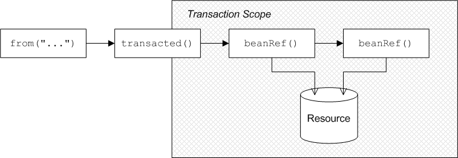
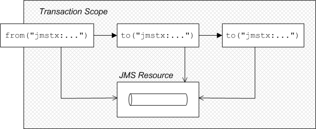
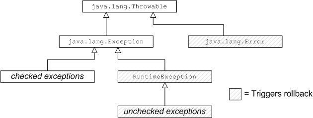

= Transactions in Camel

Having configured (available to be referenced) 3 different types of services:

* transaction manager under `javax.transaction.UserTransaction`, `javax.transaction.TransactionManager` and/or
`org.springframework.transaction.PlatformTransactionManager` interfaces - only *one* transaction manager should be used
* JDBC data source(s) under `javax.sql.DataSource` interface(s) - often more than one
* JMS connection factory(ies) under `javax.jms.ConnectionFactory` interface(s) - often more than one

we're ready to actually write an application.

.Abstract
We're going to describe Camel-specific configuration related to transaction, data source and connection factory
management.

NOTE: We're going to describe several Spring-related concepts like `SpringTransactionPolicy`. While there's clear
distinction between *Spring XML DSL* and *Blueprint XML DSL* (XML languages to define Camel contexts in XML) and
that Spring XML DSL is now _deprecated_ in {f7}, Camel transaction mechanisms still use Spring library internally.

Most of the information below is not dependant on the kind of `PlatformTransactionManager` used. If the
`PlatformTransactionManager` is actual Narayana Transaction manager, full JTA transactions will be used. If
`PlatformTransactionManager` is defined as (for example) local Blueprint `<bean>`, e.g.,
`org.springframework.jms.connection.JmsTransactionManager`, local transactions will be used.

== Transaction demarcation

.Abstract
Transaction demarcation refers to the procedures for starting, committing, and rolling back transactions.
This section describes the mechanisms that are available for controlling transaction demarcation,
both by programming and by configuration.

=== Demarcation by Marking the Route

.Overview
Apache Camel provides a simple mechanism for initiating a transaction in a route, by inserting the
`transacted()` command in the Java DSL or by inserting the `<transacted/>` tag in the XML DSL.

.Sample route with JDBC resource
Figure 5.1, “Demarcation by Marking the Route” shows an example of a route that is made transactional by adding
the `transacted()` DSL command to the route. All of the route nodes following the `transacted()` node are included
in the transaction scope. In this example, the two following nodes access a JDBC resource.

.Figure 5.1. Demarcation by Marking the Route

The transacted processor demarcates transactions as follows: when an exchange enters the transacted processor,
the transacted processor invokes the default transaction manager to begin a transaction (attaching it to the current
thread); when the exchange reaches the end of the remaining route, the transacted processor invokes the transaction
manager to commit the current transaction.

.Route definition in Java DSL

The following Java DSL example shows how to define a transactional route by marking the route with the `transacted()`
DSL command:
[source,java,options="nowrap"]
....
import org.apache.camel.builder.RouteBuilder;

class MyRouteBuilder extends RouteBuilder {
    public void configure() {
        from("file:src/data?noop=true")
                .transacted()
                .bean("accountService","credit")
                .bean("accountService","debit");
    }
}
....

In this example, the file endpoint reads some files in XML format that describe a transfer of funds from one account
to another. The first `bean()` invocation credits the specified sum of money to the beneficiary's account and then
the second `bean()` invocation subtracts the specified sum of money from the sender's account.
Both of the `bean()` invocations cause updates to be made to a database resource, which we are assuming is bound to
the transaction through the transaction manager (for example, see <<Section 2.6.1 “JDBC Data Source”,???>>).

.Route definition in Blueprint XML

The preceding route can equivalently be expressed in Blueprint XML, where the `<transacted />` tag is used to mark
the route as transactional, as follows:
[source,xml,options="nowrap"]
....
<blueprint xmlns="http://www.osgi.org/xmlns/blueprint/v1.0.0"
        xmlns:xsi="http://www.w3.org/2001/XMLSchema-instance" ...>

    <camelContext xmlns="http://camel.apache.org/schema/blueprint">
        <route>
            <from uri="file:src/data?noop=true" />
            <transacted />
            <bean ref="accountService" method="credit" />
            <bean ref="accountService" method="debit" />
        </route>
    </camelContext>

</blueprint>
....

.Default transaction manager and transacted policy
To demarcate transactions, the transacted processor must be associated with a particular transaction manager instance.
To save you having to specify the transaction manager every time you invoke `transacted()`,
the transacted processor automatically picks a sensible default. For example, if there is only one instance of a
transaction manager in your configuration, the transacted processor implicitly picks this transaction manager and uses
it to demarcate transactions.

A transacted processor can also be configured with a transacted policy, of `TransactedPolicy` type, which encapsulates
a propagation policy and a transaction manager (see <<Section 5.3 “Propagation Policies”,???>> for details).
The following rules are used to pick the default transaction manager or transaction policy:

1. If there is only one bean of `org.apache.camel.spi.TransactedPolicy` type, use this bean.
+
NOTE: The `TransactedPolicy` type is a base type of the `SpringTransactionPolicy` type that is described in
<<Section 5.3 “Propagation Policies”,???>>. Hence, the bean referred to here could be a `SpringTransactionPolicy` bean.
2. If there is a bean of type, `org.apache.camel.spi.TransactedPolicy`, which has the `ID`, `PROPAGATION_REQUIRED`,
use this bean.
3. If there is only one bean of `org.springframework.transaction.PlatformTransactionManager` type, use this bean.

You also have the option of specifying a bean explicitly by providing the bean ID as an argument to
`transacted()` — see the section called <<Sample route with PROPAGATION_NEVER policy in Java DSL,???>>.

.Transaction scope

If you insert a transacted processor into a route, a new transaction is created each time an exchange passes through
this node and the transaction's scope is defined as follows:

1. The transaction is associated with the current thread only.
2. The transaction scope encompasses all of the route nodes following the transacted processor.

In particular, all of the route nodes preceding the transacted processor are not included in the transaction (but
the situation is different, if the route begins with a transactional endpoint — see
<<Section 5.2 “Demarcation by Transactional Endpoints”,???>>). For example, the following route is incorrect,
because the `transacted()` DSL command mistakenly appears after the first `bean()` call (which accesses the database
resource):
[source,java,options="nowrap"]
....
// Java
import org.apache.camel.builder.RouteBuilder;

public class MyRouteBuilder extends RouteBuilder {
    ...
    public void configure() {
        from("file:src/data?noop=true")
                .bean("accountService", "credit")
                .transacted()  // <-- WARNING: Transaction started in the wrong place!
                .bean("accountService", "debit");
    }
}
....

.No thread pools in a transactional route
It is crucial to understand that a given transaction is associated with the current thread only. It follows that you
must not create a thread pool in the middle of a transactional route, because the processing in the new threads will
not participate in the current transaction. For example, the following route is bound to cause problems:

[source,java,options="nowrap"]
....
// Java
import org.apache.camel.builder.RouteBuilder;

public class MyRouteBuilder extends RouteBuilder {
    ...
    public void configure() {
        from("file:src/data?noop=true")
                .transacted()
                .threads(3)  // WARNING: Subthreads are not in transaction scope!
                .bean("accountService", "credit")
                .bean("accountService", "debit");
    }
}
....

A route like the preceding one is certain to corrupt your database, because the `threads()` DSL command is
incompatible with transacted routes. Even if the `threads()` call precedes the `transacted()` call, the route will not
behave as expected.

.Breaking a route into fragments
If you want to break a route into fragments and have each route fragment participate in the current transaction,
you can use `direct:` endpoints. For example, to send exchanges to separate route fragments, depending on whether
the transfer amount is big (greater than 100) or small (less than or equal to 100), you can use the `choice()`
DSL command and direct endpoints, as follows:

[source,java,options="nowrap"]
....
// Java
import org.apache.camel.builder.RouteBuilder;

public class MyRouteBuilder extends RouteBuilder {
    ...
    public void configure() {
        from("file:src/data?noop=true")
                .transacted()
                .bean("accountService", "credit")
                .choice().when(xpath("/transaction/transfer[amount > 100]"))
                .to("direct:txbig")
                .otherwise()
                .to("direct:txsmall");

        from("direct:txbig")
                .bean("accountService", "debit")
                .bean("accountService", "dumpTable")
                .to("file:target/messages/big");

        from("direct:txsmall")
                .bean("accountService", "debit")
                .bean("accountService", "dumpTable")
                .to("file:target/messages/small");
    }
}
....

Both the fragment beginning with `direct:txbig` and the fragment beginning with `direct:txsmall` participate in the
current transaction, because the direct endpoints are synchronous. This means that the fragments execute in the
same thread as the first route fragment and, therefore, they are included in the same transaction scope.

NOTE: You must not use `seda` endpoints to join the route fragments, because `seda` consumer endpoints create a new
thread (or threads) to execute the route fragment (asynchronous processing). Hence, the fragments would not
participate in the original transaction.

.Resource endpoints
The following Apache Camel components act as resource endpoints when they appear as the destination of a route
(for example, if they appear in the `to()` DSL command). That is, these endpoints can access a transactional resource,
such as a database or a persistent queue. The resource endpoints can participate in the current transaction,
as long as they are associated with the same transaction manager as the transacted processor that initiated the current
transaction.

* JMS
* ActiveMQ
* AMQP
* JavaSpace
* JPA
* Hibernate
* iBatis
* JBI
* JCR
* JDBC
* LDAP

.Sample route with resource endpoints
For example, the following route sends the order for a money transfer to two different JMS queues:
the `credits` queue processes the order to credit the receiver's account; and the `debits` queue processes the order
to debit the sender's account. Since there must only be a credit, if there is a corresponding debit, it makes sense
to enclose the enqueueing operations in a single transaction. If the transaction succeeds, both the credit order
and the debit order will be enqueued, but if an error occurs, neither order will be enqueued.

[source,java,options="nowrap"]
....
from("file:src/data?noop=true")
        .transacted()
        .to("jmstx:queue:credits")
        .to("jmstx:queue:debits");
....

=== Demarcation by Transactional Endpoints

.Overview

If a consumer endpoint at the start of a route accesses a resource, the `transacted()` command is of no use,
because it initiates the transaction after an exchange is polled. In other words, the transaction starts
too late to include the consumer endpoint within the transaction scope. The correct approach in this case is to
make the endpoint itself responsible for initiating the transaction. An endpoint that is capable of managing
transactions is known as a _transactional endpoint_.

.Sample route with JMS endpoint
Figure 5.2, “Demarcation by Transactional Endpoints” shows an example of a route that is made transactional
by the presence of a transactional endpoint at the start of the route (in the `from()` command). All of the route nodes
are included in the transaction scope. In this example, all of the endpoints in the route access a JMS resource.

Figure 5.2. Demarcation by Transactional Endpoints

There are two different models of demarcation by transactional endpoint, as follows:

* General case — normally, a transactional endpoint demarcates transactions as follows: when an exchange arrives at
the endpoint (or when the endpoint successfully polls for an exchange), the endpoint invokes its associated
transaction manager to begin a transaction (attaching it to the current thread); and when the exchange reaches the
end of the route, the transactional endpoint invokes the transaction manager to commit the current transaction.
* JMS endpoint with _InOut_ exchange — when a JMS consumer endpoint receives an _InOut_ exchange and this exchange is
routed to another JMS endpoint, this must be treated as a special case. The problem is that the route can deadlock,
if you try to enclose the entire request/reply exchange in a single transaction.

.Route definition in Java DSL
The following Java DSL example shows how to define a transactional route by starting the route with a transactional
endpoint:
[source,java,options="nowrap"]
....
from("jmstx:queue:giro")
        .to("jmstx:queue:credits")
        .to("jmstx:queue:debits");
....

Where the transaction scope encompasses the endpoints, `jmstx:queue:giro`, `jmstx:queue:credits`, and
`jmstx:queue:debits`.
If the transaction succeeds, the exchange is permanently removed from the `giro` queue and pushed on to the
`credits` queue and the `debits` queue; if the transaction fails, the exchange does not get put on to the `credits`
and `debits` queues and the exchange is pushed back on to the `giro` queue (by default, JMS will automatically attempt
to redeliver the message).
The JMS component bean, `jmstx`, must be explicitly configured to use transactions, as follows:

[source,xml,options="nowrap"]
....
<blueprint ...>
    <bean id="jmstx" class="org.apache.camel.component.jms.JmsComponent">
        <property name="configuration" ref="jmsConfig" />
    </bean>

    <bean id="jmsConfig" class="org.apache.camel.component.jms.JmsConfiguration">
        <property name="connectionFactory" ref="jmsConnectionFactory" />
        <property name="transactionManager" ref="jmsTransactionManager" />
        <property name="transacted" value="true" />
    </bean>
    ...
</blueprint>
....

Where the transaction manager instance, `jmsTransactionManager`, is associated with the JMS component and the
`transacted` property is set to `true` to enable transaction demarcation for _InOnly_ exchanges.

.Route definition in Blueprint XML
The preceding route can equivalently be expressed in Blueprint XML, as follows:
[source,xml,options="nowrap"]
....
<blueprint xmlns="http://www.osgi.org/xmlns/blueprint/v1.0.0">

    <camelContext xmlns="http://camel.apache.org/schema/blueprint">
        <route>
            <from uri="jmstx:queue:giro" />
            <to uri="jmstx:queue:credits" />
            <to uri="jmstx:queue:debits" />
        </route>
    </camelContext>

</blueprint>
....

.`transacted()` not required
The `transacted()` DSL command is not required in a route that starts with a transactional endpoint.
Nevertheless, assuming that the default transaction policy is `PROPAGATION_REQUIRED` (see
<<Section 5.3 “Propagation Policies”,???>>), it is usually harmless to include the `transacted()` command, as in this
example:
[source,java,options="nowrap"]
....
from("jmstx:queue:giro")
        .transacted()
        .to("jmstx:queue:credits")
        .to("jmstx:queue:debits");
....

However, it is possible for this route to behave in unexpected ways — for example, if a single `TransactedPolicy`
bean having a non-default propagation policy is created in Blueprint XML (see the section
called <<Default transaction manager and transacted policy,???>>) — so it is generally better not to include the
`transacted()` DSL command in routes that start with a transactional endpoint.

.Transactional endpoints
The following Apache Camel components act as transactional endpoints when they appear at the start of a route
(for example, if they appear in the `from()` DSL command). That is, these endpoints can be configured to behave as
a transactional client and they can also access a transactional resource.

* JMS
* ActiveMQ
* AMQP
* JavaSpace
* JPA

=== Demarcation by Declarative Transactions

.Overview
When using Blueprint XML, you can also demarcate transactions by declaring transaction policies in your Blueprint
XML file. By applying the appropriate transaction policy to a bean or bean method (for example, the `Required` policy),
you can ensure that a transaction is started whenever that particular bean or bean method is invoked. At the end of
the bean method, the transaction will be committed. (This approach is analogous to the way that transactions are dealt
with in Enterprise Java Beans).

OSGi declarative transactions enable you to define transaction policies at the following scopes in your blueprint
file:

* the section called <<Bean-level declaration>>
* the section called <<Top-level declaration>>

.Bean-level declaration
To declare transaction policies at the bean level, insert a `tx:transaction` element as a child of the `bean` element,
as follows:
[source,xml,options="nowrap"]
----
<blueprint xmlns="http://www.osgi.org/xmlns/blueprint/v1.0.0"
        xmlns:tx="http://aries.apache.org/xmlns/transactions/v1.1.0">

    <bean id="accountFoo" class="org.jboss.fuse.example.Account">
        <tx:transaction method="*" value="Required" />
        <property name="accountName" value="Foo" />
    </bean>

    <bean id="accountBar" class="org.jboss.fuse.example.Account">
        <tx:transaction method="*" value="Required" />
        <property name="accountName" value="Bar" />
    </bean>

</blueprint>
----

In the preceding example, the Required transaction policy is applied to all methods of the `accountFoo` bean and
the `accountBar` bean (where the method attribute specifies the wildcard, `*`, to match all bean methods).

.Top-level declaration
To declare transaction policies at the top level, insert a `tx:transaction` element as a child of the `blueprint`
element, as follows:
[source,xml,options="nowrap"]
----
<blueprint xmlns="http://www.osgi.org/xmlns/blueprint/v1.0.0"
        xmlns:tx="http://aries.apache.org/xmlns/transactions/v1.1.0">

    <tx:transaction bean="account*" value="Required" />

    <bean id="accountFoo" class="org.jboss.fuse.example.Account">
        <property name="accountName" value="Foo" />
    </bean>

    <bean id="accountBar" class="org.jboss.fuse.example.Account">
        <property name="accountName" value="Bar" />
    </bean>

</blueprint>
----

In the preceding example, the `Required` transaction policy is applied to all methods of every bean whose
`ID` matches the pattern, `account*`.

.`tx:transaction attributes`
The `tx:transaction` element supports the following attributes:

`bean`::
(Top-level only) Specifies a list of bean IDs (comma or space separated) to which the transaction policy applies.
For example:
+
[source,xml,options="nowrap"]
----
<blueprint ...>
    <tx:transaction bean="accountFoo,accountBar" value="..." />
</blueprint>
----
+
You can also use the wildcard character, `*`, which may appear at most once in each list entry. For example:
+
[source,xml,options="nowrap"]
----
<blueprint ...>
    <tx:transaction bean="account*,jms*" value="..." />
</blueprint>
----
+
If the bean attribute is omitted, it defaults to `*` (matching all non-synthetic beans in the blueprint file).

`method`::
(Top-level and bean-level) Specifies a list of method names (comma or space separated) to which the transaction
policy applies. For example:
+
[source,xml,options="nowrap"]
----
<bean id="accountFoo" class="org.jboss.fuse.example.Account">
    <tx:transaction method="debit,credit,transfer" value="Required" />
    <property name="accountName" value="Foo" />
</bean>
----
+
You can also use the wildcard character, `*`, which may appear at most once in each list entry.
+
If the method attribute is omitted, it defaults to `*` (matching all methods in the applicable beans).

value::
(Top-level and bean-level) Specifies the transaction policy. The policy values have the same semantics as the policies
defined in the EJB 3.0 specification, as follows:
* `Required` — support a current transaction; create a new one if none exists.
* `Mandatory` — support a current transaction; throw an exception if no current transaction exists.
* `RequiresNew` — create a new transaction, suspending the current transaction if one exists.
* `Supports` — support a current transaction; execute non-transactionally if none exists.
* `NotSupported` — do not support a current transaction; rather always execute non-transactionally.
* `Never` — do not support a current transaction; throw an exception if a current transaction exists.

=== Propagation Policies

.Overview
If you want to influence the way a transactional client creates new transactions, you can doJmsTransactionManager so by specifying a
transaction policy for it. In particular, Spring transaction policies enable you to specify a propagation behavior
for your transaction. For example, if a transactional client is about to create a new transaction and it detects that
a transaction is already associated with the current thread, should it go ahead and create a new transaction,
suspending the old one? Or should it simply let the existing transaction take over? These kinds of behavior are
regulated by specifying the propagation behavior on a transaction policy.

Transaction policies are instantiated as beans in Blueprint XML. You can then reference a transaction policy
by providing its bean `ID` as an argument to the `transacted()` DSL command. For example, if you want to initiate
transactions subject to the behavior, `PROPAGATION_REQUIRES_NEW`, you could use the following route:

[source,java,options="nowrap"]
....
from("file:src/data?noop=true")
        .transacted("PROPAGATION_REQUIRES_NEW")
        .bean("accountService","credit")
        .bean("accountService","debit")
        .to("file:target/messages");
....

Where the `PROPAGATION_REQUIRES_NEW` argument specifies the bean `ID` of a transaction policy bean that is configured
with the `PROPAGATION_REQUIRES_NEW` behavior (see <<Example 5.1 “Transaction Policy Beans”,???>>).

.Spring transaction policies

Apache Camel lets you define Spring transaction policies using the `org.apache.camel.spring.spi.SpringTransactionPolicy`
class (which is essentially a wrapper around a native Spring class). The `SpringTransactionPolicy` class encapsulates
two pieces of data:

* A reference to a transaction manager (of `PlatformTransactionManager` type).
* A propagation behavior.

For example, you could instantiate a Spring transaction policy bean with `PROPAGATION_MANDATORY` behavior, as follows:
[source,xml,options="nowrap"]
....
<blueprint ...>
  <bean id="PROPAGATION_MANDATORY "class="org.apache.camel.spring.spi.SpringTransactionPolicy">
    <property name="transactionManager" ref="txManager" />
    <property name="propagationBehaviorName" value="PROPAGATION_MANDATORY" />
  </bean>
  ...
</blueprint>
....

.Propagation behaviors
The following propagation behaviors are supported by Spring (where these values were originally modelled on the
propagation behaviors supported by JavaeEE):

PROPAGATION_MANDATORY::
Support a current transaction; throw an exception if no current transaction exists.

PROPAGATION_NESTED::
Execute within a nested transaction if a current transaction exists, else behave like `PROPAGATION_REQUIRED`.
+
NOTE: Nested transactions are not supported by all transaction managers.

PROPAGATION_NEVER::
Do not support a current transaction; throw an exception if a current transaction exists.

PROPAGATION_NOT_SUPPORTED::
Do not support a current transaction; rather always execute non-transactionally.
+
NOTE: This policy requires the current transaction to be suspended, a feature which is not supported by all
transaction managers.

PROPAGATION_REQUIRED::
(Default) Support a current transaction; create a new one if none exists.

PROPAGATION_REQUIRES_NEW::
Create a new transaction, suspending the current transaction if one exists.
+
NOTE: Suspending transactions is not supported by all transaction managers.

PROPAGATION_SUPPORTS::
Support a current transaction; execute non-transactionally if none exists.

.Defining policy beans in Blueprint XML

<<Example 5.1 “Transaction Policy Beans”,???>> shows how to define transaction policy beans for all of the supported
propagation behaviors. For convenience, each of the bean IDs matches the specified value of the propagation behavior
value, but in practice you can use whatever value you like for the bean IDs.

Example 5.1. Transaction Policy Beans

[source,xml,options="nowrap"]
....
<blueprint xmlns="http://www.osgi.org/xmlns/blueprint/v1.0.0"
        xmlns:xsi="http://www.w3.org/2001/XMLSchema-instance">

    <bean id="PROPAGATION_MANDATORY " class="org.apache.camel.spring.spi.SpringTransactionPolicy">
        <property name="transactionManager" ref="txManager" />
        <property name="propagationBehaviorName" value="PROPAGATION_MANDATORY" />
    </bean>

    <bean id="PROPAGATION_NESTED" class="org.apache.camel.spring.spi.SpringTransactionPolicy">
        <property name="transactionManager" ref="txManager" />
        <property name="propagationBehaviorName" value="PROPAGATION_NESTED" />
    </bean>

    <bean id="PROPAGATION_NEVER" class="org.apache.camel.spring.spi.SpringTransactionPolicy">
        <property name="transactionManager" ref="txManager" />
        <property name="propagationBehaviorName" value="PROPAGATION_NEVER" />
    </bean>

    <bean id="PROPAGATION_NOT_SUPPORTED" class="org.apache.camel.spring.spi.SpringTransactionPolicy">
        <property name="transactionManager" ref="txManager" />
        <property name="propagationBehaviorName" value="PROPAGATION_NOT_SUPPORTED" />
    </bean>

    <!-- This is the default behavior. -->
    <bean id="PROPAGATION_REQUIRED" class="org.apache.camel.spring.spi.SpringTransactionPolicy">
        <property name="transactionManager" ref="txManager" />
    </bean>

    <bean id="PROPAGATION_REQUIRES_NEW" class="org.apache.camel.spring.spi.SpringTransactionPolicy">
        <property name="transactionManager" ref="txManager" />
        <property name="propagationBehaviorName" value="PROPAGATION_REQUIRES_NEW" />
    </bean>

    <bean id="PROPAGATION_SUPPORTS" class="org.apache.camel.spring.spi.SpringTransactionPolicy">
        <property name="transactionManager" ref="txManager" />
        <property name="propagationBehaviorName" value="PROPAGATION_SUPPORTS" />
    </bean>

</blueprint>
....

NOTE:
If you want to paste any of these bean definitions into your own Blueprint XML configuration, remember to customize
the references to the transaction manager. That is, replace references to `txManager` with the actual `ID` of your
transaction manager bean.

.Sample route with `PROPAGATION_NEVER` policy in Java DSL

A simple way of demonstrating that transaction policies have some effect on a transaction is to insert a
`PROPAGATION_NEVER` policy into the middle of an existing transaction, as shown in the following route:

[source,java,options="nowrap"]
----
from("file:src/data?noop=true")
        .transacted()
        .bean("accountService","credit")
        .transacted("PROPAGATION_NEVER")
        .bean("accountService","debit");
----

Used in this way, the `PROPAGATION_NEVER` policy inevitably aborts every transaction, leading to a transaction
rollback. You should easily be able to see the effect of this on your application.

NOTE: Remember that the string value passed to `transacted()` is a bean `ID`, not a propagation behavior name.
In this example, the bean `ID` is chosen to be the same as a propagation behavior name, but this need not always be the
case. For example, if your application uses more than one transaction manager, you might end up with more than one
policy bean having a particular propagation behavior. In this case, you could not simply name the beans after
the propagation behavior.

.Sample route with `PROPAGATION_NEVER` policy in Blueprint XML

The preceding route can be also be defined in Blueprint XML, as follows:
[source,xml,options="nowrap"]
----
<blueprint xmlns="http://www.osgi.org/xmlns/blueprint/v1.0.0"
        xmlns:xsi="http://www.w3.org/2001/XMLSchema-instance">

    <camelContext xmlns="http://camel.apache.org/schema/blueprint">
        <route>
            <from uri="file:src/data?noop=true" />
            <transacted />
            <bean ref="accountService" method="credit" />
            <transacted ref="PROPAGATION_NEVER" />
            <bean ref="accountService" method="debit" />
        </route>
    </camelContext>

</blueprint>
----

=== Error Handling and Rollbacks

.Overview
While you can use standard Apache Camel error handling techniques in a transactional route, it is important to
understand the interaction between exceptions and transaction demarcation. In particular, you need to bear in mind
that thrown exceptions usually cause transaction rollback.

.How to roll back a transaction
You can use one of the following approaches to roll back a transaction:

* the section called <<Runtime exceptions as rollbacks,???>>
* the section called <<The rollback() DSL command,???>>
* the section called <<The markRollbackOnly() DSL command,???>>

.Runtime exceptions as rollbacks
The most common way to roll back a Spring transaction is to throw a runtime (unchecked) exception—that is, where
the exception is an instance or subclass of `java.lang.RuntimeException`. Java errors, of `java.lang.Error` type,
also trigger transaction rollback. Checked exceptions, on the other hand, do not trigger rollback.

Figure 5.3, “Errors and Exceptions that Trigger Rollback” summarises how Java errors and exceptions affect
transactions, where the classes that trigger rollback are shaded gray.
Figure 5.3. Errors and Exceptions that Trigger Rollback

NOTE: The Spring framework also provides a system of XML annotations that enable you to specify which exceptions
should or should not trigger rollbacks. For details, see Rolling back in the Spring Reference Guide.

WARNING: If a runtime exception is handled within the transaction (that is, before the exception has the chance
to percolate up to the code that does the transaction demarcation), the transaction will not be rolled back.
See the section called <<How to define a dead letter queue,???>> for details.

.The `rollback()` DSL command
If you want to trigger a rollback in the middle of a transacted route, you can do this by calling the `rollback()`
DSL command, which throws an `org.apache.camel.RollbackExchangeException` exception. In other words, the `rollback()`
command uses the standard approach of throwing a runtime exception to trigger the rollback.

For example, if you decide that there should be an absolute limit on the size of money transfers in the account
services application, you could trigger a rollback when the amount exceeds 100, using the following code:

Example 5.2. Rolling Back an Exception with `rollback()`
[source,java,options="nowrap"]
----
from("file:src/data?noop=true")
    .transacted()
    .bean("accountService","credit")
    .choice().when(xpath("/transaction/transfer[amount > 100]"))
        .rollback()
    .otherwise()
        .to("direct:txsmall");

from("direct:txsmall")
    .bean("accountService","debit")
    .bean("accountService","dumpTable")
    .to("file:target/messages/small");
----

NOTE: If you trigger a rollback in the preceding route, it will get trapped in an infinite loop. The reason for this
is that the `RollbackExchangeException` exception thrown by `rollback()` propagates back to the `file` endpoint at the
start of the route. The File component has a built-in reliability feature that causes it to resend any exchange
for which an exception has been thrown. Upon resending, of course, the exchange just triggers another rollback,
leading to an infinite loop.

The `markRollbackOnly()` DSL command
The `markRollbackOnly()` DSL command enables you to force the current transaction to roll back, without throwing an
exception. This can be useful in cases where (as in <<Example 5.2 “Rolling Back an Exception with rollback(),???>>)
throwing an exception has unwanted side effects.

For example, <<Example 5.3 “Rolling Back an Exception with markRollbackOnly(),???>> shows how to modify
<<Example 5.2 “Rolling Back an Exception with rollback()”,???>> by replacing `rollback()` with `markRollbackOnly()`.
This version of the route solves the problem of the infinite loop. In this case, when the amount of the money
transfer exceeds 100, the current transaction is rolled back, but no exception is thrown. Because the file endpoint
does not receive an exception, it does not retry the exchange, and the failed transactions is quietly discarded.

Example 5.3. Rolling Back an Exception with markRollbackOnly()
[source,java,options="nowrap"]
----
from("file:src/data?noop=true")
    .transacted()
    .bean("accountService","credit")
    .choice().when(xpath("/transaction/transfer[amount > 100]"))
        .markRollbackOnly()
    .otherwise()
        .to("direct:txsmall");
...
----

The preceding route implementation is not ideal, however. Although the route cleanly rolls back the transaction
(leaving the database in a consistent state) and avoids the pitfall of infinite looping, it does not keep any record
of the failed transaction. In a real-world application, you would typically want to keep track of any failed
transaction. For example, you might want to write a letter to the relevant customer in order to explain why the
transaction did not succeed. A convenient way of tracking failed transactions is to add a dead-letter queue
to the route.

.How to define a dead letter queue
In order to keep track of failed transactions, you can define an `onException()` clause, which enables you to divert
the relevant exchange object to a dead-letter queue. When used in the context of transactions, however, you need
to be careful about how you define the onException() clause, because of potential interactions between exception
handling and transaction handling. <<Example 5.4 “How to Define a Dead Letter Queue”,???>> shows the correct way to
define an `onException()` clause, assuming that you need to suppress the rethrown exception.

Example 5.4. How to Define a Dead Letter Queue
[source,java,options="nowrap"]
----
// Java
import org.apache.camel.builder.RouteBuilder;

public class MyRouteBuilder extends RouteBuilder {
    ...
    public void configure() {
        onException(IllegalArgumentException.class)
            .maximumRedeliveries(1)
            .handled(true)
            .to("file:target/messages?fileName=deadLetters.xml&fileExist=Append")
            .markRollbackOnly();  // NB: Must come *after* the dead letter endpoint.

        from("file:src/data?noop=true")
            .transacted()
            .bean("accountService","credit")
            .bean("accountService","debit")
            .bean("accountService","dumpTable")
            .to("file:target/messages");
    }
}
----

In the preceding example, `onException()` is configured to catch the `IllegalArgumentException` exception and send the
offending exchange to a dead letter file, `deadLetters.xml` (of course, you can change this definition to catch
whatever kind of exception arises in your application). The exception rethrow behavior and the transaction rollback
behavior are controlled by the following special settings in the `onException()` clause:

* `handled(true)` — suppress the rethrown exception. In this particular example, the rethrown exception is undesirable
because it triggers an infinite loop when it propagates back to the file endpoint (see the section called
<<The markRollbackOnly() DSL command,???>>). In some cases, however, it might be acceptable to rethrow the exception
(for example, if the endpoint at the start of the route does not implement a retry feature).
* `markRollbackOnly()` — marks the current transaction for rollback without throwing an exception. Note that it is
essential to insert this DSL command after the `to()` command that routes the exchange to the dead letter queue.
Otherwise, the exchange would never reach the dead letter queue, because `markRollbackOnly()` interrupts the chain
of processing.

.Catching exceptions around a transaction
Instead of using `onException()`, a simple approach to handling exceptions in a transactional route is to use the
`doTry()` and `doCatch()` clauses around the route. For example,
<<Example 5.5, “Catching Exceptions with doTry() and doCatch()”,???> shows how you can catch and handle the
`IllegalArgumentException` in a transactional route, without the risk of getting trapped in an infinite loop.

Example 5.5. Catching Exceptions with doTry() and doCatch()
[source,java,options="nowrap"]
----
// Java
import org.apache.camel.builder.RouteBuilder;

public class MyRouteBuilder extends RouteBuilder {
    ...
    public void configure() {
        from("file:src/data?noop=true")
            .doTry()
                .to("direct:split")
            .doCatch(IllegalArgumentException.class)
                .to("file:target/messages?fileName=deadLetters.xml&fileExist=Append")
            .end();

        from("direct:split")
            .transacted()
            .bean("accountService","credit")
            .bean("accountService","debit")
            .bean("accountService","dumpTable")
            .to("file:target/messages");
    }
}
----

In this example, the route is split into two segments. The first segment (from the `file:src/data` endpoint) receives
the incoming exchanges and performs the exception handling using `doTry()` and `doCatch()`. The second segment
(from the `direct:split` endpoint) does all of the transactional work. If an exception occurs within this transactional
segment, it propagates first of all to the `transacted()` command, causing the current transaction to be rolled back,
and it is then caught by the `doCatch()` clause in the first route segment. The `doCatch()` clause does not rethrow
the exception, so the file endpoint does not do any retries and infinite looping is avoided.
